## 1. GMP 模型简介

G-M-P 分别代表：

- **G - Goroutine**，Go 协程，是参与调度与执行的最小单位。
- **M - Machine**，指的是系统级线程，它直接关联一个 os 内核线程，用于执行 G。
- **P - Processor**，指的是逻辑处理器，P 关联了的本地可运行 G 的队列(也称为 LRQ)，最多可存放 256 个 G。P** 里面一般会存当前 goroutine 运行的上下文环境（函数指针，堆栈地址及地址边界）**，P 会对自己管理的 goroutine 队列做一些调度。

## 2. GMP 调度流程

<figure markdown="span">
  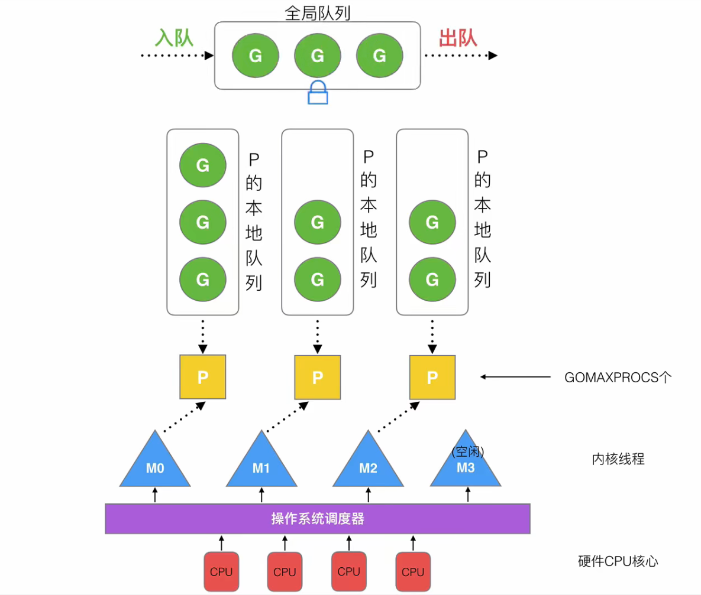{ width="800" }
  <figcaption>GMP模型</figcaption>
</figure>

在 Go 中，线程是运行 goroutine 的实体，调度器的功能是把可运行的 goroutine 分配到工作线程上

- **全局队列（Global Queue）**：存放等待运行的 G
- **P 的本地队列（LRQ）**：同全局队列类似，存放的也是等待运行的 G，存的数量有限，不超过 256 个。新建 G'时，G'优先加入到 P 的本地队列，如果队列满了，则会把本地队列中一半的 G 移动到全局队列
- **P 列表**：所有的 P 都在程序启动时创建，并保存在数组中，最多有 GOMAXPROCS(可配置)个
- **M**：线程想运行任务就得获取 P，从 P 的本地队列获取 G，P 队列为空时，M 也会尝试从全局队列拿一批 G 放到 P 的本地队列，或从其他 P 的本地队列一半放到自己 P 的本地队列。M 运行 G，G 执行之后，M 会从 P 获取下一个 G，不断重复下去

!!!note "P 和 M 的数量问题"

    - **P的数量**：环境变量 `$GOMAXPROCS`；在程序中通过 `runtime.GOMAXPROCS()` 来设置
    - **M的数量**：**Go默认限制最大是 10000个** (但是操作系统达不到)；通过 `runtime/debug` 包中的 `SetMaxThreads` 函数来设置；有一个M阻塞，会创建一个新的M；如果有M空闲，那么就会回收或者休眠

    M与P的数量没有绝对关系，一个M阻塞，P就会去创建或者切换另一个M，所以，**即使P的默认数量是1，也有可能会创建很多个M出来**。

## 3. 调度器的设计策略

golang 调度器的设计策略思想主要有以下几点：

- 复用线程
- 利用并行
- 抢占
- 全局 G 队列

### 3.1. 复用线程

golang 在复用线程上主要体现在 **work stealing 机制** 和 **hand off 机制**（偷别人的去执行，和自己扔掉执行）

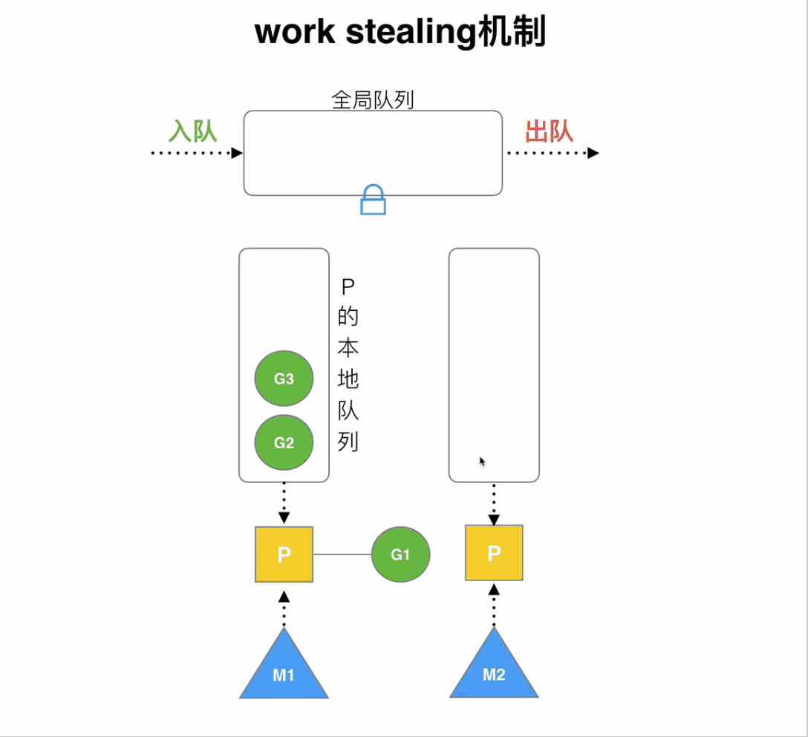

!!!note "work stealing 机制"

    干完活的线程与其等着，不如去帮其他线程干活，于是它就去其他线程的队列里窃取一个任务来执行。而在这时它们会访问同一个队列，所以为了减少窃取任务线程和被窃取任务线程之间的竞争，通常会使用**双端队列，被窃取任务线程永远从双端队列的头部拿任务执行，而窃取任务的线程永远从双端队列的尾部拿任务执行**。

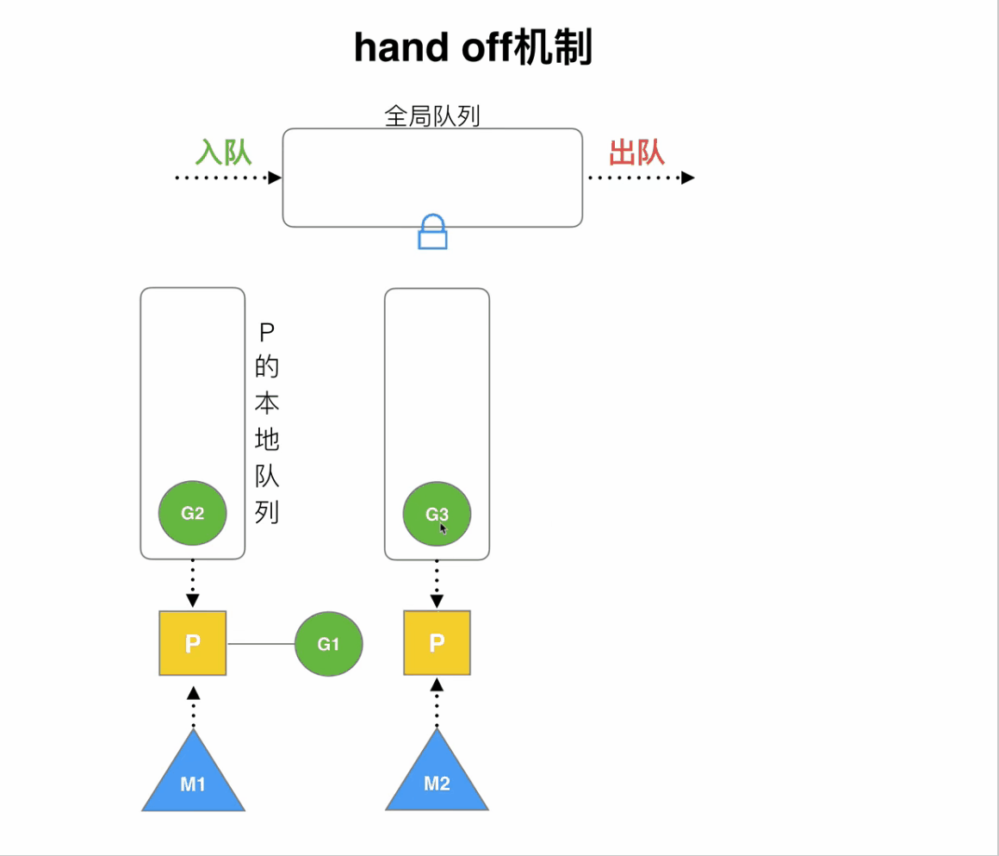

!!!note "hand off 机制"

    当本线程因为G进行系统调用阻塞时，线程释放绑定的P，把P转移给其他空闲的线程执行，此时M1如果长时间阻塞，可能会执行睡眠或销毁。

### 3.2. 利用并行

我们可以使用 GOMAXPROCS 设置 P 的数量，这样的话最多有 GOMAXPROCS 个线程分布在多个 CPU 上同时运行。

GOMAXPROCS 也限制了并发的程度，比如 GOMAXPROCS = 核数/2，则最多利用了一半的 CPU 核进行并行

### 3.3. 抢占策略

- 1 对 1 模型的调度器，需要等待一个 co-routine 主动释放后才能轮到下一个进行使用
- golang 中，如果一个 goroutine 使用 10ms 还没执行完，CPU 资源就会被其他 goroutine 所抢占

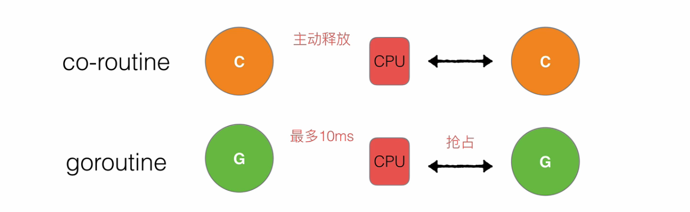

### 3.4. 全局 G 队列

- 全局 G 队列其实是复用线程的补充，当工作窃取时，优先从全局队列去取，取不到才从别的 p 本地队列取（1.17 版本）
- 在新的调度器中依然有全局 G 队列，但功能已经被弱化了，当 M 执行 work stealing 从其他 P 偷不到 G 时，它可以从全局 G 队列获取 G

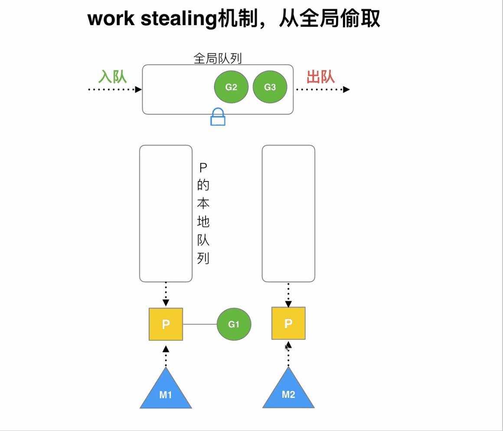

## 4. go func()经历了那些过程？

<figure markdown="span">
  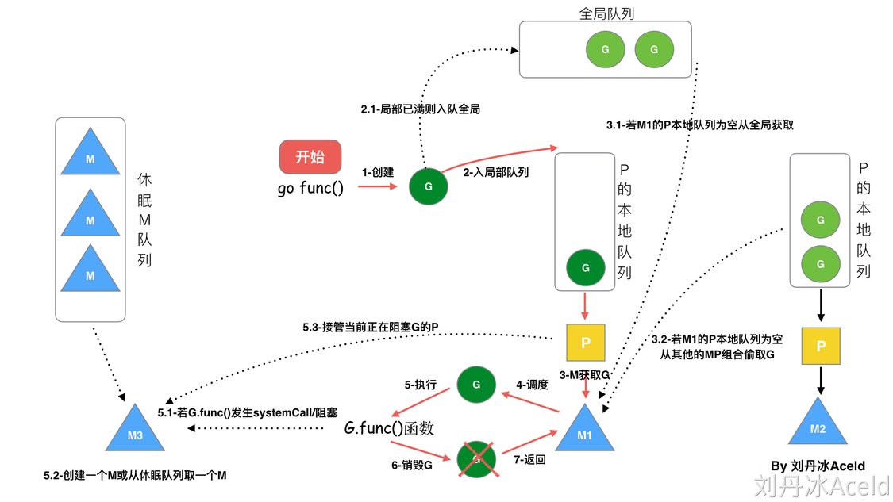{ width="800" }
  <figcaption>go func()</figcaption>
</figure>

1. 我们通过 `go func()` 来创建一个 goroutine
2. 有两个存储 G 的队列，一个是局部调度器 P 的本地队列、一个是全局 G 队列。新创建的 G 会先保存在 P 的本地队列中，如果 P 的本地队列已经满了就会保存在全局的队列中
3. **G 只能运行在 M 中，一个 M 必须持有一个 P，M 与 P 是 1：1 的关系**。M 会从 P 的本地队列弹出一个可执行状态的 G 来执行，如果 P 的本地队列为空，就会想其他的 MP 组合偷取一个可执行的 G 来执行
4. 一个 M 调度 G 执行的过程是一个循环机制
5. 当 M 执行某一个 G 时候如果发生了 `syscall` 或者**其他阻塞**操作，M 会阻塞，如果当前有一些 G 在执行，runtime 会把这个线程 M 从 P 中摘除(detach)，然后再创建一个新的操作系统的线程(如果有空闲的线程可用就复用空闲线程)来服务于这个 P
6. 当 M 系统调用结束时候，这个 G 会尝试获取一个空闲的 P 执行，并放入到这个 P 的本地队列。如果获取不到 P，那么这个线程 M 变成休眠状态， 加入到空闲线程中，然后这个 G 会被放入全局队列中

## 5. GMP 场景分析

### 5.1. G1 创建 G3

P 拥有 G1，M1 获取 P 后开始运行 G1，G1 使用 go func()创建了 G2，为了局部性 G2 优先加入到 P1 的本地队列

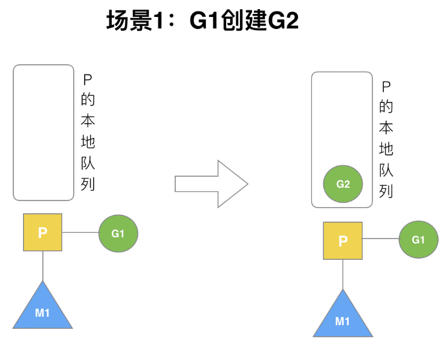{ width="600" }

### 5.2. G1 执行完毕

G1 运行完成后(函数：goexit)，M 上运行的 goroutine 切换为 G0，G0 负责调度时协程的切换（函数：schedule）。从 P 的本地队列取 G2，从 G0 切换到 G2，并开始运行 G2(函数：execute)。实现了线程 M1 的复用

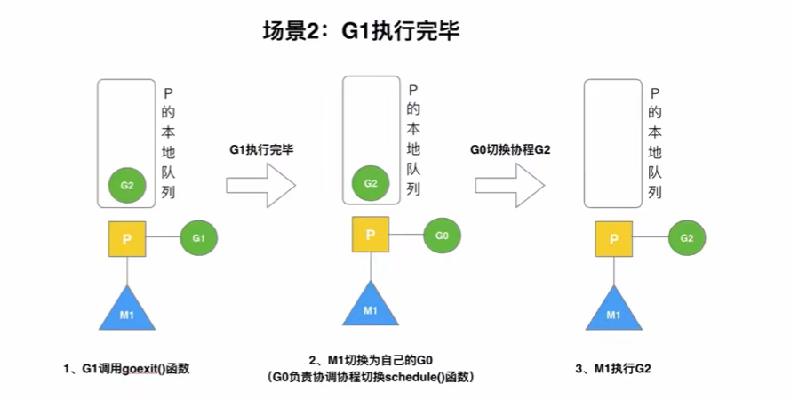

### 5.3. G 溢出

假设每个 P 的本地队列只能存 3 个 G。G2 要创建了 6 个 G，前 3 个 G（G3, G4, G5）已经加入 p1 的本地队列，p1 本地队列满了

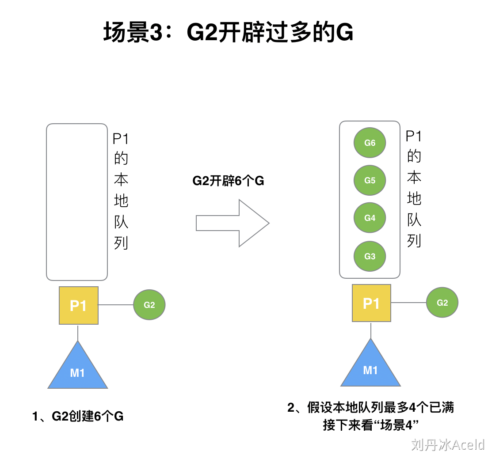{ width="600" }

G2 在创建 G7 的时候，发现 P1 的`本地队列`已满，需要执行**负载均衡**（把 P1 中本地队列中前一半的 G，还有新创建 G**转移**到全局队列）。

**移走前一半的`G`是为了防止后面 G`饥饿`**

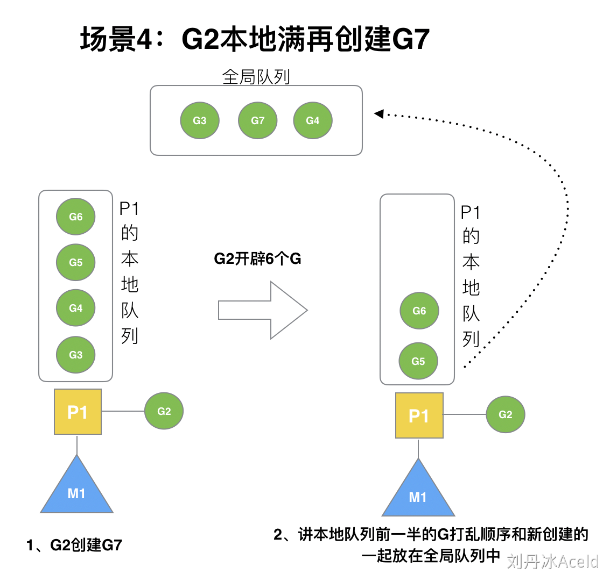{ width="600" }

这些 G 被转移到全局队列时，会被打乱顺序。所以 G3,G4,G7 被转移到全局队列。

G2 创建 G8 时，P1 的本地队列未满，**所以 G8 会被加入到 P1 的本地队列**

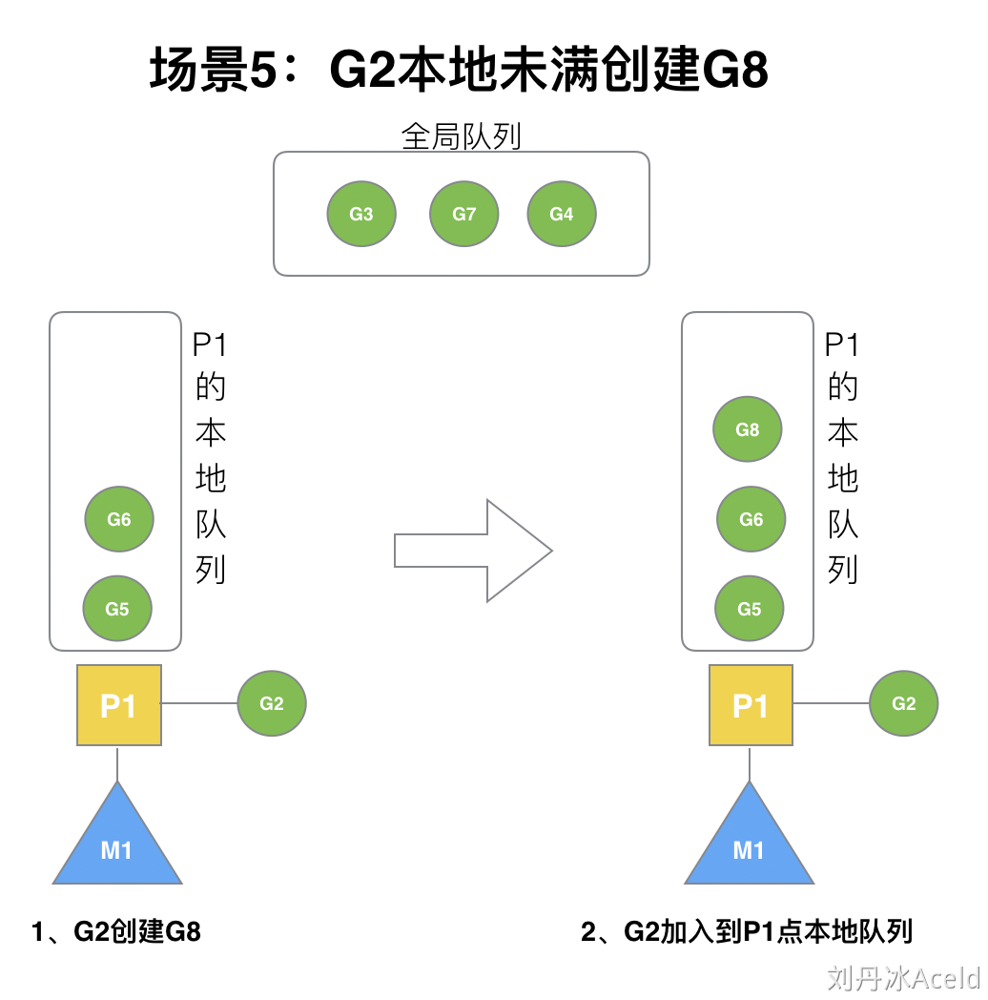{ width="600" }

### 5.4. 唤醒正在休眠的 M

规定：**在创建 G 时，运行的 G 会尝试唤醒其他空闲的 P 和 M 组合去执行**

假定 G2 唤醒了 M2，M2 绑定了 P2，并运行 G0，但 P2 本地队列没有 G，M2 此时为`自旋线程`**（没有 G 但为运行状态的线程，不断寻找 G）**

先从全局队列中获取，没有再从其他线程中偷取（**先全后偷**）

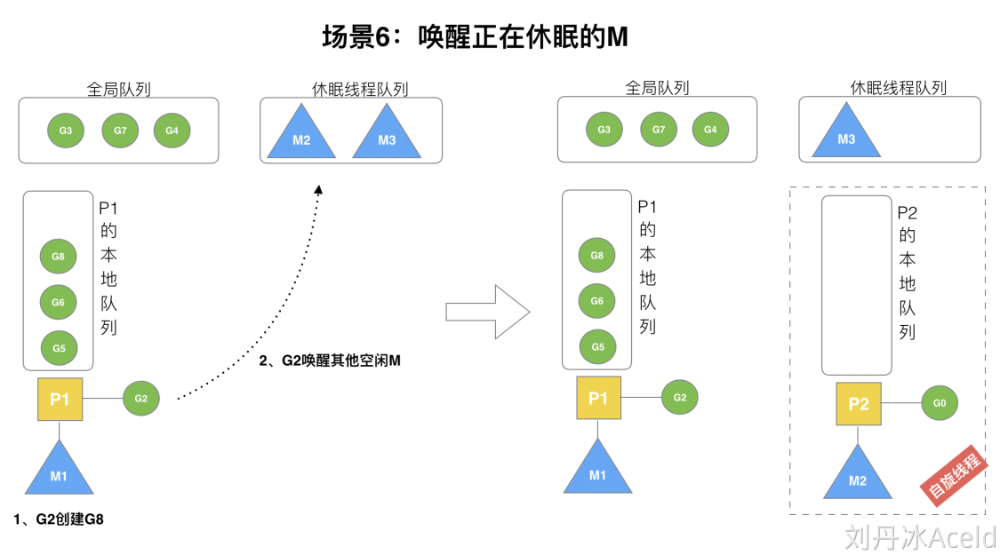{center}

### 5.5. 自旋线程获取 G

M2 尝试从全局队列(简称“GQ”)取一批 G 放到 P2 的本地队列（函数：`findrunnable()`）。M2 从全局队列取的 G 数量符合下面的公式：

```go
n =  min(len(GQ) / GOMAXPROCS +  1,  cap(LQ) / 2 )
```

- GQ：全局队列总长度（队列中现在元素的个数）
- GOMAXPROCS：p 的个数
- 至少从全局队列取 1 个 g，但每次不要从全局队列移动太多的 g 到 p 本地队列，给其他 p 留点。这是**从全局队列到 P 本地队列的负载均衡**
- 假定我们场景中一共有 4 个 P（GOMAXPROCS 设置为 4，那么我们允许最多就能用 4 个 P 来供 M 使用）。所以 M2 只从能从全局队列取 1 个 G（即 G3）移动 P2 本地队列，然后完成从 G0 到 G3 的切换，运行 G3
- 当 M2 有了新的 G（不再是 G0），便不是 **自旋线程** 了


相关源码参考：

```go
// 从全局队列中偷取，调用时必须锁住调度器
func globrunqget(_p_ *p, max int32) *g {
	// 如果全局队列中没有 g 直接返回
	if sched.runqsize == 0 {
		return nil
	}

	// per-P 的部分，如果只有一个 P 的全部取
	n := sched.runqsize/gomaxprocs + 1
	if n > sched.runqsize {
		n = sched.runqsize
	}

	// 不能超过取的最大个数
	if max > 0 && n > max {
		n = max
	}

	// 计算能不能在本地队列中放下 n 个
	if n > int32(len(_p_.runq))/2 {
		n = int32(len(_p_.runq)) / 2
	}

	// 修改本地队列的剩余空间
	sched.runqsize -= n
	// 拿到全局队列队头 g
	gp := sched.runq.pop()
	// 计数
	n--

	// 继续取剩下的 n-1 个全局队列放入本地队列
	for ; n > 0; n-- {
		gp1 := sched.runq.pop()
		runqput(_p_, gp1, false)
	}
	return gp
}
```

### 5.6. M2 从 M1 中偷取 G

**全局队列已经没有 G，那 m 就要执行 work stealing(偷取)：从其他有 G 的 P 哪里偷取一半 G 过来，放到自己的 P 本地队列**。P2 从 P1 的本地队列尾部取一半的 G，本例中一半则只有 1 个 G8，放到 P2 的本地队列并执行。

**偷取队列元素的一半**

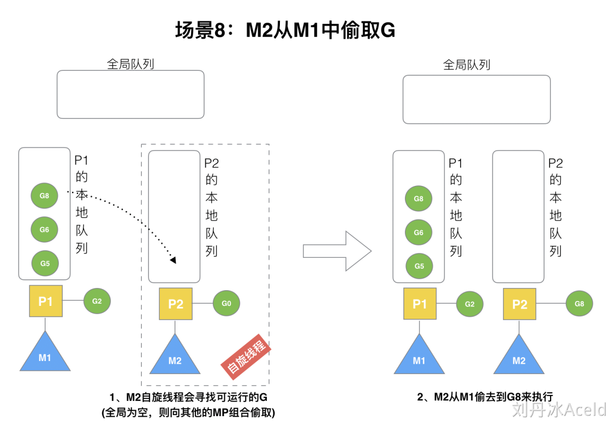

### 5.7. 自旋线程的最大限制

G1 本地队列 G5、G6 已经被其他 M 偷走并运行完成，当前 M1 和 M2 分别在运行 G2 和 G8，M3 和 M4 没有 goroutine 可以运行，M3 和 M4 处于**自旋状态**，它们不断寻找 goroutine

- 正在运行的 M + 自旋线程 <= GOMAXPROCS
- 如果 M 大于 P，则进入休眠线程队列

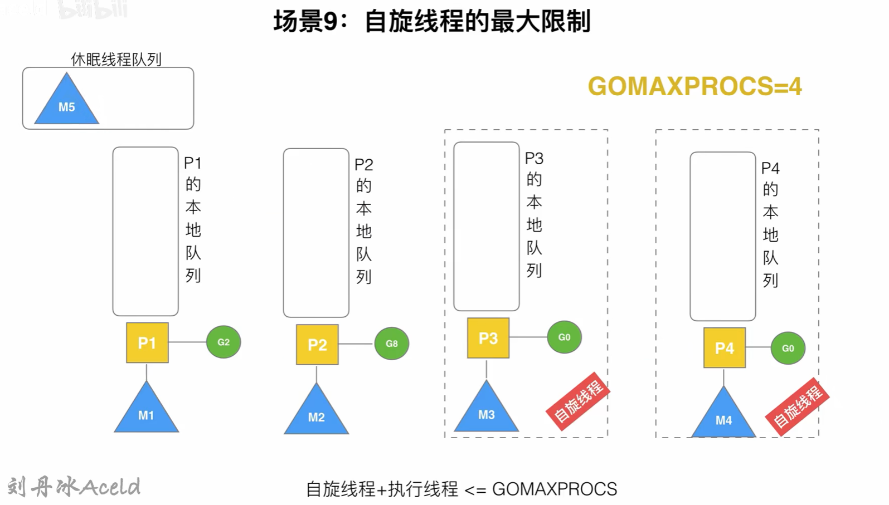

!!!question "为什么要让 m3 和 m4 自旋？"

    自旋本质是在运行，线程在运行却没有执行 G，就变成了浪费 CPU

!!!question "为什么不销毁现场，来节约 CPU 资源？"

    因为创建和销毁 CPU 也会浪费时间，我们**希望当有新 goroutine 创建时，立刻能有 M 运行它**，如果销毁再新建就增加了时延，降低了效率

当然也考虑了过多的自旋线程是浪费 CPU，所以系统中最多有`GOMAXPROCS`个自旋的线程(当前例子中的`GOMAXPROCS`=4，所以一共 4 个 P)，多余的没事做线程会让他们休眠。

### 5.8. G 发送系统调用/阻塞

假定当前除了 M3 和 M4 为自旋线程，还有 M5 和 M6 为空闲的线程(没有得到 P 的绑定，注意我们这里最多就只能够存在 4 个 P，所以 P 的数量应该永远是 M>=P，大部分都是 M 在抢占需要运行的 P)，G8 创建了 G9，G8 进行了**阻塞的系统调用**，M2 和 P2 立即解绑，P2 会执行以下判断：

- 如果 P2 本地队列有 G、全局队列有 G 或有空闲的 M，P2 都会立马唤醒 1 个 M 和它绑定，否则 P2 则会加入到空闲 P 列表，等待 M 来获取可用的 p。

本场景中，P2 本地队列有 G9，可以和其他空闲的线程 M5 绑定。

**自旋线程抢占 G，不抢占 P**

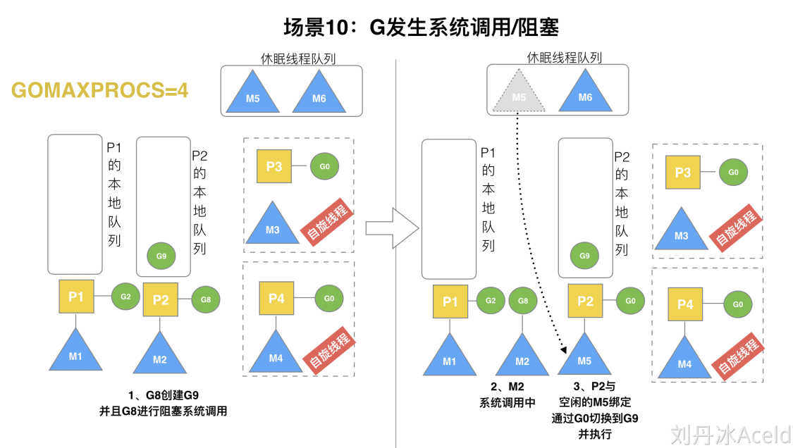

### 5.9. G 发送系统调用/非阻塞

上述`G8`如果执行完毕，此时 M2 会首先寻找之前的 P，如果没有则尝试从`空闲p队列`中获取，如果没获取不到，会进入`M阻塞队列`中（长时间休眠等待 GC 回收销毁）
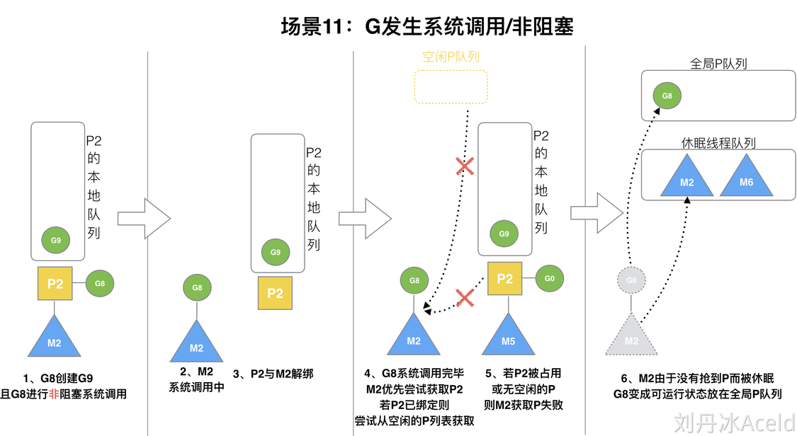

[^1]: 参考 [golang 大杀器——GMP 模型](https://github.com/fengyuan-liang/notes/blob/main/GoLang/golang%E5%A4%A7%E6%9D%80%E5%99%A8GMP%E6%A8%A1%E5%9E%8B.md)
