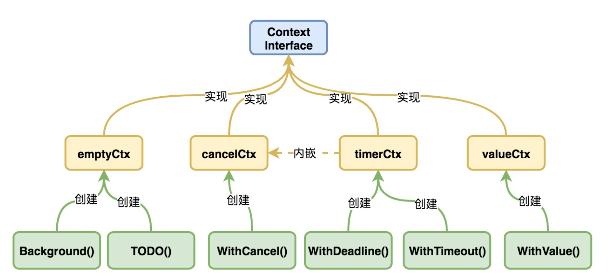

## 进程、线程、协程有什么区别？（必问）

- **进程**：是应用程序的启动实例，每个进程都有独立的内存空间，不同的进程通过进程间的通信方式来通信。
- **线程**：从属于进程，每个进程至少包含一个线程，**线程是 CPU 调度的基本单位**，多个线程之间可以共享进程的资源并通过共享内存等线程间的通信方式来通信。
- **协程**：为轻量级线程，与线程相比，协程不受操作系统的调度，协程的调度器由用户应用程序提供，协程调度器按照调度策略把协程调度到线程中运行

## Go 面向对象是如何实现的？

Go 实现面向对象的两个关键是 `struct` 和 `interface`。

- **封装**：对于同一个包，对象对包内的文件可见；对不同的包，需要将对象以大写开头才是可见的。
- **继承**：继承是编译时特征，**在 struct 内加入所需要继承的类即可**：
- **多态**：多态是运行时特征，**Go 多态通过 interface 来实现**。类型和接口是松耦合的，某个类型的实例可以赋给它所实现的任意接口类型的变量。

## make 和 new 的区别？

- new 只用于分配内存，返回一个指向地址的指针。它为每个新类型分配一片内存，初始化为 0 且**返回类型 \*T 的内存地址**，它相当于 `&T{}`。
- make 只可用于 slice，map，channel 的初始化，**返回的是引用**。

## defer 的执行顺序

**defer 执行顺序和调用顺序相反**，类似于栈后进先出(LIFO)。

panic 错误并不能终止 defer 的执行。

## 空 struct{} 的用途

1. 用 map 模拟一个 set，那么就要把值置为 struct{}，struct{}本身不占任何空间，可以避免任何多余的内存分配。
2. 有时候给通道发送一个空结构体，channel<-struct{}{}，也是节省了空间。
3. 仅有方法的结构体

## init() 函数是什么时候执行的？

在 main 函数之前执行。init()函数是 go 初始化的一部分，由 runtime 初始化每个导入的包，初始化不是按照从上到下的导入顺序，而是**按照解析的依赖关系，没有依赖的包最先初始化。**

每个包首先初始化包作用域的常量和变量（常量优先于变量），然后执行包的 init()函数。同一个包，甚至是同一个源文件可以有多个 init()函数。init()函数没有入参和返回值，不能被其他函数调用，同一个包内多个 init()函数的执行顺序不作保证。

**执行顺序：import –> const –> var –>init()–>main()**

## Go 的值类型和引用类型

**值类型**：int、float、bool、string、array、sturct 等

**引用类型**：slice，map，channel，interface，func 等

- **值类型**作为参数时，称为**深拷贝**，形参改变，实参不变，因为**传递的是值的副本，形参会新开辟一块空间，与实参指向不同**。
- **引用类型**作为参数时，称为**浅拷贝**，形参改变，实参数跟随变化。因为**传递的是地址，形参和实参都指向同一块地址**。

!!!note

    - map/channel 本身就是指针，是引用类型，所以直接传 map 和 channel 本身就可以。
    - slice 的赋值操作其实是针对 slice 结构体内部的指针进行操作，也是指针，可以直接传 slice 本身。

## Go 语言到底是值传递，还是引用传递？

Go 里面没有引用传递，**Go 语言是值传递**。

> - 值传递：指在调用函数时将实际参数复制一份传递到函数中，这样在函数中如果对参数进行修改，将不会影响到实际参数。
> - 引用传递：指在调用函数时将实际参数的地址直接传递到函数中，那么在函数中对参数所进行的修改，将影响到实际参数。

## unsafe.Pointer

1. 任何类型的指针都可以被转化为 `unsafe.Pointer`；
2. `unsafe.Pointer `可以被转化为任何类型的指针；
3. `uintptr` 可以被转化为 `unsafe.Pointer`；
4. `unsafe.Pointer` 可以被转化为 `uintptr`。

!!!note

    **`uintptr` 是一个整数类型，足够大能保存任何一种指针类型**。`uintptr` 指的是具体的内存地址，不是个指针，因此 uintptr 地址关联的对象可以被垃圾回收。**而 `unsafe.Pointer` 有指针语义，可以保护它不会被垃圾回收。**

**unsafe.Pointer** 有两个最重要的作用：

- 作为不同类型指针互相转换的中介；
- 利用 `uintptr` 突破指针不能进行算术运算的限制，从而达到直接操作内存的目的。

{==

**unsafe.Pointer 类型可以绕开 Go 语言的类型系统，还可以直接操作内存**，方便了很多代码的编写，且提升了代码性能，比如：底层类型相同的指针之间的转换，访问结构体私有字段等。**但同时因为其特性，使其变得很不安全，因此需要慎用**。

==}

## 什么是内存逃逸？

Go 语言中，**堆内存是通过垃圾回收机制自动管理的**，无需开发者指定。那么，Go 编译器怎么知道某个变量需要分配在栈上，还是堆上呢？**编译器决定内存分配位置的方式，就称之为逃逸分析(escape analysis)。逃逸分析由编译器完成，作用于编译阶段。** 不逃逸的对象放栈上，可能逃逸的放堆上。

### 为何需要逃逸分析？

1. 减少 gc 压力，栈上的变量，随着函数退出后系统直接回收，不需要 gc 标记后再清除。
2. 减少内存碎片的产生。
3. 减轻分配堆内存的开销，提高程序的运行速度。

### 如何确定是否逃逸？

```go
go build -gcflags '-m -l' main.go
```

- `-m` 会打印出逃逸分析的优化策略，实际上最多总共可以用 4 个 -m，但是信息量较大，一般用 1 个就可以了。
- `-l` 会禁用函数内联，在这里禁用掉内联能更好的观察逃逸情况，减少干扰。

### 内存逃逸的情况：

- **指针逃逸**：在函数中创建了一个对象，返回了这个对象的指针。
- **interface{}动态类型逃逸**：如果函数参数为 interface{}，编译期间很难确定其参数的具体类型，也会发生逃逸。
- **栈空间不足**：当栈空间不足以存放当前对象或无法判断当前切片长度时会将对象分配到堆中。
- **闭包引用对象逃逸**：闭包函数如果访问了外部变量，函数销毁，但变量不会回收，会逃逸到堆上。
- **变量较大（栈空间不足）**和 **变量大小不确定（如 slice 长度或容量不定）**也会引起逃逸

## Go 解析 Tag 是怎么实现的？

在 Go 语言中，标签（Tag）是附加到结构体字段的元信息，它是以字符串的形式存储的。这些标签**可以通过反射（reflection）机制来获取**，并可以被用于各种目的。

```go
type User struct {
  Name    string `json:"name"`
  Email   string `json:"email"`
  Age     int    `json:"age"`
}
```

常见用途

1. 序列化和反序列化
2. 数据验证
3. 数据库 ORM 映射
4. HTTP 路由和处理

## Go 内存分配

Golang 内存分配管理策略是按照不同大小的对象和不同的内存层级来分配管理内存。通过这种多层级分配策略，形成无锁化或者降低锁的粒度，以及尽量减少内存碎片，来提高内存分配效率。

|  类别  |            大小            |
| :----: | :------------------------: |
| 微对象 |   `tiny object (0, 16B)`   |
| 小对象 | `small object [16B, 32KB]` |
| 大对象 | `large object (32KB, +∞)`  |

Golang 中内存管理的层级从最下到最上可以分为：`mspan -> mcache -> mcentral -> mheap -> heapArena`。golang 中对象的内存分配流程如下：

1. **小于 16 个字节的对象**使用 **mcache** 的微对象分配器进行分配内存
2. **大小在 16 个字节到 32k 字节之间的对象**，首先计算出需要使用的 span 大小规格，然后使用 mcache 中相同大小规格的 **mspan** 分配
3. 如果对应的大小规格在 **mcache** 中没有可用的 mspan，则向 **mcentral** 申请
4. 如果 **mcentral** 中没有可用的 **mspan**，则向 **mheap** 申请，并根据 **BestFit 算法**找到最合适的 **mspan**。如果申请到的 **mspan** 超出申请大小，将会根据需求进行切分，以返回用户所需的页数，剩余的页构成一个新的 mspan 放回 **mheap** 的空闲列表
5. 如果 **mheap** 中没有可用 **span**，则向操作系统申请一系列新的页（最小 1MB）
6. **对于大于 32K 的大对象**直接从 **mheap** 分配

## Go Context 简介

> 参考：[上下文 - context](https://go.cyub.vip/concurrency/context/)

Context 是由 Golang 官方开发的并发控制包，一方面可以**用于当请求超时或者取消时，相关的 goroutine 马上退出释放资源**，另一方面 **Context 本身含义就是上下文，其可以在多个 goroutine 或者多个处理函数之间传递共享的信息**。

Context 接口一共包含四个方法：

- `Deadline`：返回绑定该 context 任务的执行超时时间，若未设置，则 ok 等于 false
- `Done`：返回一个只读通道，当绑定该 context 的任务执行完成并调用 cancel 方法或者任务执行超时时候，该通道会被关闭
- `Err`：返回一个错误，如果 Done 返回的通道未关闭则返回 nil,如果 context 如果被取消，返回 Canceled 错误，如果超时则会返回 DeadlineExceeded 错误
- `Value`：根据 key 返回，存储在 context 中 k-v 数据

### 实现 Context 接口的类型

Context 一共有 4 个类型实现了 Context 接口, 分别是 `emptyCtx, cancelCtx, timerCtx, valueCtx`。每个类型都关联一个创建方法。



### Context 的使用场景

```go
ctx, cancel := context.WithTimeout(context.Background(), time.Second*5)
defer cancel()

for {
    select {
    default:
      fmt.Println("work")
    case <-ctx.Done():
      fmt.Println("work done")
      return
    }
}

```

1. **并发控制**：`context.WithCancel`。当我们需要同时启动多个 goroutine 进行任务处理时，我们可以使用 Context 来控制这些 goroutine 的执行。在每个 goroutine 中，我们都可以检测 Context 对象是否被取消，如果是，则退出 goroutine 的执行，否则继续执行。
2. **超时控制**：`context.WithTimeout`。对一个操作设置一个超时时间时，我们可以使用 Context 来控制这个操作的执行时间。在操作执行超时时，我们可以通知 Context 对象和其子 Context 对象取消执行。
3. **数据库连接**：`context.WithTimeout`。使用 Context 来控制连接的生命周期。
4. **HTTP 请求**：`context.WithTimeout`。设置一个超时时间，以确保请求能够在规定的时间内得到响应。`http.NewRequestWithContext(ctx, http.MethodGet, "https://www.example.com", nil)`。
5. **gRPC 请求**：`context.WithTimeout`。

!!!note "Context 使用规范"

    使用 Context 的是应该准守以下原则来保证在不同包中使用时候的接口一致性，以及能让静态分析工具可以检查 context 的传播：

    - 不要将 Context 作为结构体的一个字段存储，相反而应该显示传递 Context 给每一个需要它的函数，Context 应该作为函数的第一个参数，并命名为 ctx
    - 不要传递一个 nil Context 给一个函数，即使该函数能够接受它。如果你不确定使用哪一个 Context，那你就传递 context.TODO
    - **context 是并发安全的**，相同的 Context 能够传递给运行在不同 goroutine 的函数

## Go 捕获子协程 panic

当一个子协程中发生 panic 时，它会向上传播直到被主协程或它的父协程捕获或导致整个程序崩溃。使用 **defer 关键字和 recover() 函数可以防止 panic** 向上传播并使程序崩溃。

```go
package main

import "fmt"

func main() {
    go func() {
        defer func() {
            if r := recover(); r != nil {
                fmt.Println("Recovered from panic:", r)
            }
        }()
        panic("Oops! Something went wrong!")
    }()
    fmt.Println("Main goroutine exiting...")
}

```

## 进程被 kill，如何保证所有 goroutine 顺利退出？

使用 Go 语言提供的 `sync.WaitGroup` 类型来实现这个功能

```go

var wg sync.WaitGroup

// 在启动新的goroutine时，调用WaitGroup的Add方法来增加goroutine的计数器
wg.Add(1)
go func() {
    // 在goroutine结束时，调用WaitGroup的Done方法来减少计数器的值
    defer wg.Done()

    // goroutine代码
}()

// 在主程序中，调用WaitGroup的Wait方法来阻塞主线程，直到所有的goroutine都结束
wg.Wait()
```

## Go Interface 介绍

在 Golang 中，interface 是一组 method 的集合，是 duck-type programming 的一种体现，鸭子类型编程。

### 为什么使用 Interface？

1. **可以实现泛型编程**：
   Sort 函数的形参是一个 interface，包含了三个方法：Len()，Less(i,j int)，Swap(i, j int)。使用的时候不管数组的元素类型是什么类型（int, float, string…），只要我们实现了这三个方法就可以使用 Sort 函数，这样就实现了“泛型编程”
2. **隐藏实现细节**：设计一个函数给你返回一个 interface，只能通过 interface 里面的方法来做一些操作，具体内部实现并不知道。例如我们常用的 context 包。
3. **可以实现面向对象编程中的多态用法**。在 Go 里面，如果某个数据类型实现 interface 中定义的那些函数，则称这些数据类型实现（implement）了这个接口 interface。
4. **空接口可以接受任何类型的参数**：在 Go 语言中，所有其它数据类型都实现了空接口。当我们给 func 定义了一个 interface{} 类型的参数(也就是一个空接口)之后，那么这个参数可以接受任何类型，官方包中最典型的例子就是标准库 fmt 包中的 Print 和 Fprint 系列的函数。==**非侵入式接口的设计模式**==。

### Go interface 的常见应用

1. **通过对象实例赋值**：
2. **interface 接口嵌套**：如 io package 中的 ReadWrite 接口，嵌套了 `io.Reader` 和 `io.Writer` 两个接口。==但 Go 语言中的接口不能递归嵌套==。
3. **interface 强制类型转换**：`ret, ok := interface.(type)` 断言，`switch x.(type)`
4. **interface 与 nil 的比较**：一个 interface{} 类型的变量包含了 2 个指针，一个指针指向值的类型 `T`，另外一个指针指向实际的值 `V`。interface 类型比较， 要是两个指针都相等，才能相等。

!!!note "2 个 interface 可以比较吗 ？"

    Go 语言中，interface 的内部实现包含了 2 个字段，类型 T 和 值 V，interface 可以使用 == 或 != 比较。2 个 interface 相等有以下 2 种情况

    - 两个 interface 均等于 nil（此时 V 和 T 都处于 unset 状态）
    - 类型 T 相同，且对应的值 V 相等。

## 2 个 nil 可能不相等吗？

可能不等。interface 在运行时绑定值，只有值为 nil 接口值才为 nil，但是与指针的 nil 不相等。举个例子：

```go
var p *int = nil
var i interface{} = nil
if(p == i){
	fmt.Println("Equal")
}
```

两者并不相同。总结：**两个 nil 只有在类型相同时才相等**。

## 如何灵活控制 goroutine 并发数量？

- 带缓冲的 channel + sync 库： `sync.WaitGroup`。
- 引用第三方库：如 [panjf2000/ants](https://github.com/panjf2000/ants)

## Go select 优先级执行

> 参考：[Go 语言在 select 语句中实现优先级](https://www.liwenzhou.com/posts/Go/priority-in-select/)

- select 不存在任何的 case：永久阻塞当前的 goroutine
- select 只存在一个 case：阻塞的发送/接收
- select 存在多个 case：随机选择一个满足条件的 case 执行
- select 存在 default，其他 case 都不满足：执行 default 中的代码

### select 语句中实现优先级

嵌套 select，组合使用 `for` 和 `LABEL`。外层 select 选中执行 `B := <-ch2`时，进入内存的 select 循环尝试执行 `A := <-ch1:`，当 `ch1` 就绪就会一直执行，否则跳出内层的 select，执行 B。

**先跑 A，A 确定没跑再跑 B**

```go
func worker(ch1, ch2 <-chan int, stopCh chan struct{}) {
	for {
		select {
		case <-stopCh:
			return
		case A := <-ch1:
			fmt.Println(job1)
		case B := <-ch2:

		priority:
			for {
				select {
				case A := <-ch1:
					fmt.Println(A)
				default:
					break priority
				}
			}
			fmt.Println(B)
		}
	}
}
```

## go slice 是怎么扩容的？

### Go <= 1.17

**以容量 1024 为临界点**

- 如果当前容量小于 1024，则判断所需容量是否大于原来容量 2 倍，如果大于，当前容量加上所需容量；否则当前容量乘 2。
- 如果当前容量大于 1024，则每次按照 1.25 倍速度递增容量，也就是每次加上 cap/4。

### Go1.18 之后，引入了新的扩容规则

> 参考：[Go 1.18 全新的切片扩容机制](https://juejin.cn/post/7101928883280150558)

Go1.18 不再以 1024 为临界点，而是**设定了一个值为 256 的 threshold，以 256 为临界点**；超过 256，不再是每次扩容 1/4，而是每次增加 `(旧容量+3*256)/4`；

- 当新切片需要的容量 cap 大于两倍扩容的容量，则直接按照新切片需要的容量扩容；
- 当原 `slice 容量 < threshold`，新 slice 容量变成原来的 2 倍；
- 当原 `slice 容量 > threshold`，进入一个循环，每次容量增加 `(旧容量+3*256)/4`。

$$
new_cap = \begin{cases}
cap                                       & if \ cap > old\_cap * 2 \\
old\_cap * 2                              & if \ old\_cap < threshold \\
old\_cap + \frac{old\_cap+3*threshold}{4} & if \ old\_cap > threshold \\
\end{cases}
$$

[^1]: [Go 语言 unsafe.Pointer 浅析](https://juejin.cn/post/7083853142403579911)
