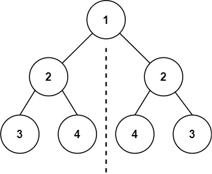
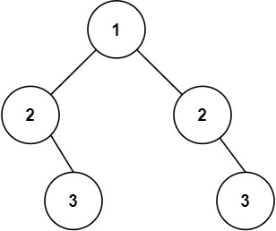

# [101. 对称二叉树](https://leetcode.cn/problems/symmetric-tree){target="_blank"}

## 题目

给你一个二叉树的根节点 root ， 检查它是否轴对称。

示例 1:

{ width="40%"}

> 输入：root = [1,2,2,3,4,4,3]

> 输出：true

示例 2:

{ width="40%"}

> 输入：root = [1,2,2,null,3,null,3]

> 输出：false

## 复杂度

双指针+虚拟头结点

- [x] 时间复杂度：$O(n)$，其中 $n$ 为二叉树的节点个数。
- [x] 空间复杂度：$O(n)$。最坏情况下，二叉树退化成一条链，递归需要 $O(n)$ 的栈空间。

## 题解

```go title="Go"
func isSameTree(p, q *TreeNode) bool {
    if p == nil || q == nil {
        return p == q
    }
    return p.Val == q.Val && isSameTree(p.Left, q.Right) && isSameTree(p.Right, q.Left)
}

func isSymmetric(root *TreeNode) bool {
    return isSameTree(root.Left, root.Right)
}
```

```python title="Python"
class Solution:
    def isSameTree(self, p: Optional[TreeNode], q: Optional[TreeNode]) -> bool:
        if not p or not q:
            return p is q
        return (
            p.val == q.val and
            self.isSameTree(p.left, q.right) and
            self.isSameTree(p.right, q.left)
        )

    def isSymmetric(self, root: Optional[TreeNode]) -> bool:
        return self.isSameTree(root.left, root.right)
```
