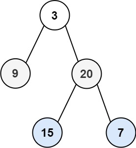

# [103. 二叉树的锯齿形层序遍历](https://leetcode.cn/problems/binary-tree-zigzag-level-order-traversal/description/){target="_blank"}

## 题目

给你二叉树的根节点 `root` ，返回其节点值的 **锯齿形层序遍历** 。（即先从左往右，再从右往左进行下一层遍历，以此类推，层与层之间交替进行）。


**示例 1:**

{width=30%}

> 输入: root = [3,9,20,null,null,15,7]

> 输出: [[3],[20,9],[15,7]]

**示例 2:**

> 输入: root = [1]

> 输出: [1]

**示例 3:**

> 输入: root = []

> 输出: []

## 题解

```go title="Go"
func zigzagLevelOrder(root *TreeNode) (ans [][]int) {
    if root == nil {
        return
    }
    cur := []*TreeNode{root}
    for len(cur) > 0 {
        nxt := []*TreeNode{}
        vals := make([]int, len(cur)) // 大小已知
        for i, node := range cur {
            if len(ans)%2 > 0 {
                vals[len(cur)-1-i] = node.Val // 倒着添加
            } else {
                vals[i] = node.Val
            }
            if node.Left != nil {
                nxt = append(nxt, node.Left)
            }
            if node.Right != nil {
                nxt = append(nxt, node.Right)
            }
        }
        cur = nxt
        ans = append(ans, vals)
    }
    return
}
```

```python title="Python"
class Solution:
    def zigzagLevelOrder(self, root: Optional[TreeNode]) -> List[List[int]]:
        if root is None:
            return []
        ans = []
        cur = [root]
        while cur:
            nxt = []
            vals = []
            for node in cur:
                vals.append(node.val)
                if node.left:  nxt.append(node.left)
                if node.right: nxt.append(node.right)
            cur = nxt
            ans.append(vals[::-1] if len(ans) % 2 else vals)
        return ans
```

### 复杂度

- [x] 时间复杂度：$O(n)$，其中 $n$ 为二叉树长度。
- [x] 空间复杂度：$O(n)$。


## 参考

- [灵茶山艾府 33. 搜索旋转排序数组](https://leetcode.cn/problems/binary-tree-zigzag-level-order-traversal/solutions/2049827/bfs-wei-shi-yao-yao-yong-dui-lie-yi-ge-s-xlv3/){target="_blank"}
