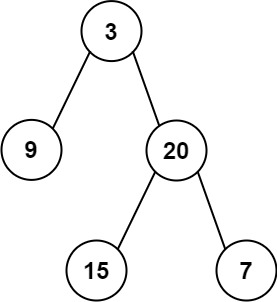

# [105. 从前序与中序遍历序列构造二叉树](https://leetcode.cn/problems/construct-binary-tree-from-preorder-and-inorder-traversal){target="_blank"}

## 题目

给定两个整数数组 `preorder` 和 `inorder` ，其中 `preorder` 是二叉树的**先序遍历**， `inorder` 是同一棵树的**中序遍历**，请构造二叉树并返回其根节点。

示例 1:

{width="30%"}

> 输入：preorder = [3,9,20,15,7], inorder = [9,3,15,20,7]

> 输出：[3,9,20,null,null,15,7]

示例 2:

> 输入：preorder = [-1], inorder = [-1]

> 输出：[-1]

## 复杂度

- [x] 时间复杂度：$O(n)$，其中 $n$ 为 $\textit{preorder}$ 的长度。递归 $O(n)$ 次，每次只需要 $O(1)$ 的时间。
- [x] 空间复杂度：$O(n)$。

## 题解

```go title="Go"
func buildTree(preorder, inorder []int) *TreeNode {
    n := len(preorder)
    index := make(map[int]int, n)
    for i, x := range inorder {
        index[x] = i
    }

    var dfs func(int, int, int, int) *TreeNode
    dfs = func(preL, preR, inL, inR int) *TreeNode {
        if preL == preR { // 空节点
            return nil
        }
        leftSize := index[preorder[preL]] - inL // 左子树的大小
        left := dfs(preL+1, preL+1+leftSize, inL, inL+leftSize)
        right := dfs(preL+1+leftSize, preR, inL+1+leftSize, inR)
        return &TreeNode{preorder[preL], left, right}
    }
    return dfs(0, n, 0, n) // 左闭右开区间
}
```

```python title="Python"
class Solution:
    def buildTree(self, preorder: List[int], inorder: List[int]) -> Optional[TreeNode]:
        index = {x: i for i, x in enumerate(inorder)}

        def dfs(pre_l: int, pre_r: int, in_l: int, in_r: int) -> Optional[TreeNode]:
            if pre_l == pre_r:  # 空节点
                return None
            left_size = index[preorder[pre_l]] - in_l  # 左子树的大小
            left = dfs(pre_l + 1, pre_l + 1 + left_size, in_l, in_l + left_size)
            right = dfs(pre_l + 1 + left_size, pre_r, in_l + 1 + left_size, in_r)
            return TreeNode(preorder[pre_l], left, right)

        return dfs(0, len(preorder), 0, len(inorder))  # 左闭右开区间
```

- [灵茶山艾府-105. 从前序与中序遍历序列构造二叉树](https://leetcode.cn/problems/construct-binary-tree-from-preorder-and-inorder-traversal/solutions/2646359/tu-jie-cong-on2-dao-onpythonjavacgojsrus-aob8/)
