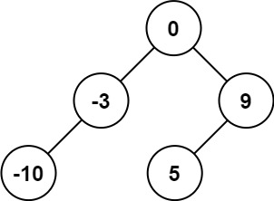
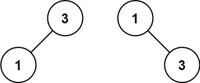

[https://leetcode.cn/problems/validate-binary-search-tree](https://leetcode.cn/problems/validate-binary-search-tree)

## 题目

给你一个整数数组 `nums` ，其中元素已经按 **升序** 排列，请你将其转换为一棵

示例 1:

{width="30%"}

> 输入：nums = [-10,-3,0,5,9]

> 输出：[0,-3,9,-10,null,5]

示例 2:

{width="30%"}

> 输入：nums = [1,3]

> 输出：[3,1]

## 复杂度

前序遍历

- 时间复杂度：$O(n)$，其中 $n$ 是数组的长度。每个数字只访问一次。
- 空间复杂度：$O(logn)$。空间复杂度主要取决于递归栈的深度，递归栈的深度是 $O(logn)$。

## 题解

```go title="Go"
func sortedArrayToBST(nums []int) *TreeNode {
    var dfs func(nums []int, left, right int) *TreeNode
    dfs = func(nums []int, left, right int) *TreeNode {
        if left > right {
            return nil
        }

        mid := (left + right + 1) / 2
        root := &TreeNode{Val: nums[mid]}
        root.Left = dfs(nums, left, mid - 1)
        root.Right = dfs(nums, mid + 1, right)
        return root
    }
    return dfs(nums)
}
```

```python title="Python"
class Solution:
    def sortedArrayToBST(self, nums: List[int]) -> Optional[TreeNode]:
        def dfs(nums: List[int], left: int, right: int) -> Optional[TreeNode]:
            if left > right:
                return None

            mid = (left + right + 1 ) // 2
            root = TreeNode(val=nums[mid])
            root.left = dfs(nums, left, mid-1)
            root.right = dfs(nums, mid+1, right)
            return root

        return dfs(nums, 0, len(nums)-1)
```
