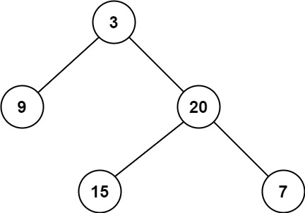

# [111. 二叉树的最小深度](https://leetcode.cn/problems/minimum-depth-of-binary-tree/){target="_blank"}

## 题目

给定一个二叉树，找出其最小深度。

最小深度是从根节点到最近叶子节点的最短路径上的节点数量。

说明：叶子节点是指没有子节点的节点。

示例 1:

{ width="40%"}

> 输入：root = [3,9,20,null,null,15,7]

> 输出：2

示例 2:

> 输入：root = [2,null,3,null,4,null,5,null,6]

> 输出：5

## 复杂度

双指针+虚拟头结点

- [x] 时间复杂度：$O(n)$。
- [x] 空间复杂度：$O(n)$。

## 题解

```go title="Go"
func minDepth(root *TreeNode) int {
    if root == nil {
        return 0
    }

    // 只有根节点
    if root.Left ==  nil && root.Right == nil {
        return 1
    }

    leftMin := minDepth(root.Left)
    rightMin := minDepth(root.Right)

    // 左子树非空, 右子树为空
    if root.Left != nil && root.right == nil {
        return 1 + leftMin
    }

    // 右子树非空, 左子树为空
    if root.Left == nil && root.right != nil {
        return 1 + rightMin
    }

    return 1 + min(leftMin, rightMin)
}

func min(a, b int) int {
    if a < b {
        return a
    }
    return b
}
```

```python title="Python"
class Solution:
    def minDepth(self, root: Optional[TreeNode]) -> int:
        if root == None:
            return 0

        # 只有根节点
        if root.left == None and root.right == None:
            return 1

        left_min = self.minDepth(root.left)
        right_min = self.minDepth(root.right)

        # 左子树非空, 右子树为空
        if root.left != None and root.right == None:
            return 1 + left_min

        # 右子树非空, 左子树为空
        if root.left == None and root.right != None:
            return 1 + right_min

        return 1 + min(left_min, right_min)
```
