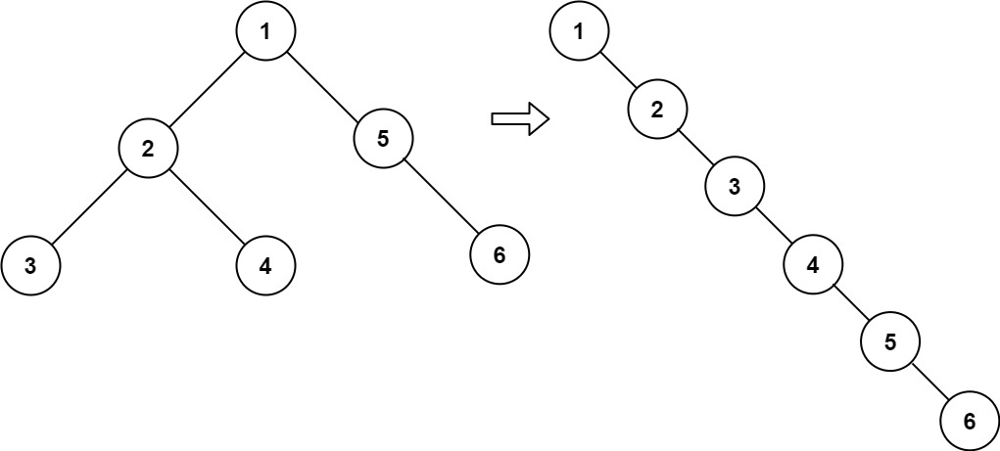

# [114. 二叉树展开为链表](https://leetcode.cn/problems/flatten-binary-tree-to-linked-list){target="_blank"}

## 题目

给你二叉树的根结点 `root` ，请你将它展开为一个单链表：

- 展开后的单链表应该同样使用 `TreeNode` ，其中 `right` 子指针指向链表中下一个结点，而左子指针始终为 `null` 。
- 展开后的单链表应该与二叉树 **先序遍历** 顺序相同。

示例 1:

{width="50%"}

> 输入：root = [1,2,5,3,4,null,6]

> 输出：[1,null,2,null,3,null,4,null,5,null,6]

示例 2:

> 输入：root = []

> 输出：[]

## 复杂度

前序遍历

- [x] 时间复杂度：$O(n)$，其中 $n$ 是数组的长度。每个数字只访问一次。
- [x] 空间复杂度：$O(n)$。空间复杂度主要取决于递归栈的深度，递归栈的深度是 $O(logn)$。

## 题解

```go title="Go"
func flatten(root *TreeNode)  {
    list := preorderTraversal(root)
    for i := 1; i < len(list); i++ {
        prev, curr := list[i-1], list[i]
        prev.Left, prev.Right = nil, curr
    }
}

func preorderTraversal(root *TreeNode) []*TreeNode {
    list := []*TreeNode{}
    if root != nil {
        list = append(list, root)
        list = append(list, preorderTraversal(root.Left)...)
        list = append(list, preorderTraversal(root.Right)...)
    }

    return list
}
```

```python title="Python"
class Solution:
    def flatten(self, root: Optional[TreeNode]) -> None:
        """
        Do not return anything, modify root in-place instead.
        """
        preorderList = []
        def preorder_traversal(root: Optional[TreeNode]):
            if root:
                preorderList.append(root)
                preorder_traversal(root.left)
                preorder_traversal(root.right)

        preorder_traversal(root)

        for i in range(1, len(preorderList)):
            prev, curr = preorderList[i-1], preorderList[i]
            prev.left, prev.right = None, curr
```
