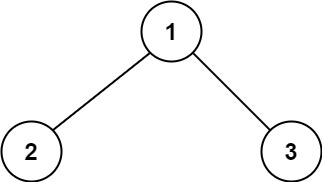
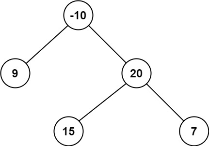

[https://leetcode.cn/problems/binary-tree-maximum-path-sum](https://leetcode.cn/problems/binary-tree-maximum-path-sum)

## 题目

二叉树中的 **路径** 被定义为一条节点序列，序列中每对相邻节点之间都存在一条边。同一个节点在一条路径序列中 **至多出现一次** 。该路径 **至少包含一个** 节点，且不一定经过根节点。

**路径和** 是路径中各节点值的总和。

给你一个二叉树的根节点 `root` ，返回其 **最大路径和** 。

示例 1:

{ width="30%"}

> 输入：root = [1,2,3]

> 输出：6

> 解释：最优路径是 2 -> 1 -> 3 ，路径和为 2 + 1 + 3 = 6

示例 2:

{ width="30%"}

> 输入：rroot = [-10,9,20,null,null,15,7]

> 输出：42

> 解释：最优路径是 15 -> 20 -> 7 ，路径和为 15 + 20 + 7 = 42

## 复杂度

- 时间复杂度：$O(n)$, 其中 $n$ 为二叉树的节点个数。
- 空间复杂度：$O(n)$。最坏情况下，二叉树退化成一条链，递归需要 $O(n)$ 的栈空间。

## 题解

```go title="Go"
func maxPathSum(root *TreeNode) int {
    ans := math.MinInt
    var dfs func(*TreeNode) int
    dfs = func(node *TreeNode) int {
        if node == nil {
            return 0 // 没有节点，和为 0
        }
        lVal := dfs(node.Left)  // 左子树最大链和
        rVal := dfs(node.Right) // 右子树最大链和
        ans = max(ans, lVal+rVal+node.Val) // 两条链拼成路径
        return max(max(lVal, rVal)+node.Val, 0) // 当前子树最大链和
    }
    dfs(root)
    return ans
}

func max(a, b int) int { if a < b { return b }; return a }
```

```python title="Python"
class Solution:
    def maxPathSum(self, root: Optional[TreeNode]) -> int:
        ans = -inf
        def dfs(node: Optional[TreeNode]) -> int:
            if node is None:
                return 0  # 没有节点，和为 0
            l_val = dfs(node.left)  # 左子树最大链和
            r_val = dfs(node.right)  # 右子树最大链和
            nonlocal ans
            ans = max(ans, l_val + r_val + node.val)  # 两条链拼成路径
            return max(max(l_val, r_val) + node.val, 0)  # 当前子树最大链和
        dfs(root)
        return ans
```

[^1]: [灵茶山艾府 - 124. 二叉树中的最大路径和](https://leetcode.cn/problems/binary-tree-maximum-path-sum/solutions/2227021/shi-pin-che-di-zhang-wo-zhi-jing-dpcong-n9s91/)
