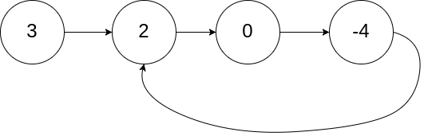
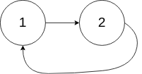

# [141. 环形链表](https://leetcode.cn/problems/linked-list-cycle-ii/){target="_blank"}

## 题目

给你一个链表的头节点 `head` ，判断链表中是否有环。

如果链表中有某个节点，可以通过连续跟踪 `next` 指针再次到达，则链表中存在环。 为了表示给定链表中的环，评测系统内部使用整数 pos 来表示链表尾连接到链表中的位置（索引从 0 开始）。**注意：`pos` 不作为参数进行传递** 。仅仅是为了标识链表的实际情况。

如果链表中存在环 ，则返回 `true` 。 否则，返回 `false` 。

示例 1:

{width="50%"}

> 输入：head = [3,2,0,-4], pos = 1

> 输出：返回索引为 1 的链表节点

示例 2:

{width="30%"}

> 输入：head = [1,2], pos = 0

> 输出：返回索引为 0 的链表节点

## 复杂度

!!!note "快慢指针"

- [x] 时间复杂度：$O(n)$，其中 $n$ 是链表中的节点数。
- [x] 空间复杂度：$O(1)$，只是用 2 个额外的指针。

## 题解

```go title="Go"
func hasCycle(head *ListNode) bool {
    slow, fast := head, head
    for fast != nil && fast.Next != nil {
        slow = slow.Next
        fast = fast.Next.Next
        if slow == fast {
            return true
        }
    }
    return false
}
```

```python title="Python"
class Solution:
    def hasCycle(self, head: Optional[ListNode]) -> bool:
        if not head or not head.next:
            return False

        slow, fast = head, head.next
        while fast and fast.next and slow != fast:
            slow = slow.next
            fast = fast.next.next

        return slow == fast
```
