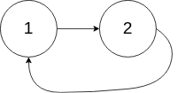

[https://leetcode.cn/problems/linked-list-cycle-ii/description/](https://leetcode.cn/problems/linked-list-cycle-ii/description/)

## 题目

给定一个链表的头节点 `head` ，返回链表开始入环的第一个节点。 _如果链表无环_，则返回 `null`。

如果链表中有某个节点，可以通过连续跟踪 next 指针再次到达，则链表中存在环。 为了表示给定链表中的环，评测系统内部使用整数 pos 来表示链表尾连接到链表中的位置（索引从 0 开始）。如果 pos 是 -1，则在该链表中没有环。注意：pos 不作为参数进行传递，仅仅是为了标识链表的实际情况。

**不允许修改** 链表。

示例 1:

{width="50%"}

> 输入：head = [3,2,0,-4], pos = 1

> 输出：返回索引为 1 的链表节点

示例 2:

{width="30%"}

> 输入：head = [1,2], pos = 0

> 输出：返回索引为 0 的链表节点

## 复杂度

双指针

- 时间复杂度：$O(n)$
- 空间复杂度：$O(1)$

## 题解

```go title="Go"
func detectCycle(head *ListNode) *ListNode {
    slow, fast := head, head
    for fast != nil && fast.Next != nil {
        slow = slow.Next
        fast = fast.Next.Next
        if slow == fast {
            ptr := head
            for slow != ptr {
                slow = slow.Next
                ptr = ptr.Next
            }
            return ptr
        }
    }
    return nil
}
```

```python title="Python"
class Solution:
    def detectCycle(self, head: Optional[ListNode]) -> Optional[ListNode]:
        slow = fast = head
        while fast and fast.next:
            slow = slow.next
            fast = fast.next.next
            if fast is slow:
                ptr = head
                while slow is not ptr:
                    slow = slow.next
                    ptr = ptr.next
                return ptr
        return None
```
