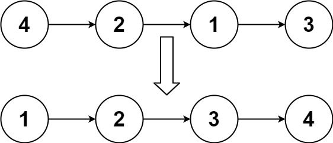
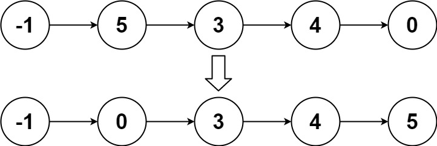

# [148. 排序链表](https://leetcode.cn/problems/sort-list){target="_blank"}

## 题目

给你链表的头结点 `head` ，请将其按 升序 排列并返回 **排序后的链表** 。

示例 1:

{ width="40%"}

> 输入：head = [4,2,1,3]

> 输出：[1,2,3,4]

示例 2:

{ width="40%"}

> 输入：head = [-1,5,3,4,0]

> 输出：[-1,0,3,4,5]

## 复杂度

!!!note "归并排序（递归法）"

- [x] 时间复杂度：$O(n logn)$。
- [x] 空间复杂度：$O(logn)$。

## 题解

```go title="Go"
func sortList(head *ListNode) *ListNode {
	if head == nil || head.Next == nil { // 递归的出口，不用排序 直接返回
		return head
	}
	slow, fast := head, head // 快慢指针
	var preSlow *ListNode    // 保存slow的前一个结点
	for fast != nil && fast.Next != nil {
		preSlow = slow
		slow = slow.Next      // 慢指针走一步
		fast = fast.Next.Next // 快指针走两步
	}
	preSlow.Next = nil  // 断开，分成两链
	l := sortList(head) // 已排序的左链
	r := sortList(slow) // 已排序的右链
	return mergeList(l, r) // 合并已排序的左右链，一层层向上返回
}

func mergeList(l1, l2 *ListNode) *ListNode {
	dummy := &ListNode{Val: 0}   // 虚拟头结点
	prev := dummy                // 用prev去扫，先指向dummy
	for l1 != nil && l2 != nil { // l1 l2 都存在
		if l1.Val < l2.Val {   // l1值较小
			prev.Next = l1 // prev.Next指向l1
			l1 = l1.Next   // 考察l1的下一个结点
		} else {
			prev.Next = l2
			l2 = l2.Next
		}
		prev = prev.Next // prev.Next确定了，prev指针推进
	}
	if l1 != nil {    // l1存在，l2不存在，让prev.Next指向l1
		prev.Next = l1
	}
	if l2 != nil {
		prev.Next = l2
	}
	return dummy.Next // 真实头结点
}
```

```python title="Python"
# Definition for singly-linked list.
# class ListNode:
#     def __init__(self, val=0, next=None):
#         self.val = val
#         self.next = next
class Solution:
    def mergeList(self, l1: Optional[ListNode], l2: Optional[ListNode]) -> Optional[ListNode]:
        dummy = ListNode()
        prev = dummy
        while l1 and l2:
            if l1.val < l2.val:
                prev.next = l1
                l1 = l1.next
            else:
                prev.next = l2
                l2 = l2.next
            prev = prev.next

        if l1:
            prev.next = l1

        if l2:
            prev.next = l2

        return dummy.next

    def sortList(self, head: Optional[ListNode]) -> Optional[ListNode]:
        if head is None or head.next is None:
            return head

        slow = fast = head
        preSlow = ListNode()
        while fast and fast.next:
            preSlow = slow
            slow = slow.next
            fast = fast.next.next

        preSlow.next = None
        l = self.sortList(head)
        r = self.sortList(slow)
        return self.mergeList(l, r)

```

## 参考
- [笨猪爆破组 - 「手画图解」归并排序 | 148 排序链表](https://leetcode.cn/problems/sort-list/solutions/493183/shou-hua-tu-jie-gui-bing-pai-xu-148-lian-biao-pai-/)
