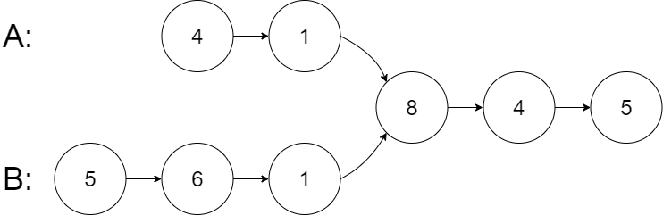
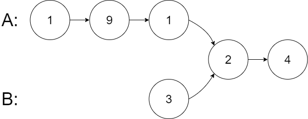

[https://leetcode.cn/problems/intersection-of-two-linked-lists](https://leetcode.cn/problems/intersection-of-two-linked-lists)

## 题目

给你两个单链表的头节点`headA`和`headB`，请你找出并返回两个单链表相交的起始节点。如果两个链表不存在相交节点，返回 null 。

示例 1:

{width="50%"}

> 输入：intersectVal = 8, listA = [4,1,8,4,5], listB = [5,6,1,8,4,5], skipA = 2, skipB = 3

> 输出：Intersected at '8'

示例 2:

{width="50%"}

> 输入：intersectVal = 2, listA = [1,9,1,2,4], listB = [3,2,4], skipA = 3, skipB = 1

> 输出：Intersected at '2'

## 复杂度

双指针+虚拟头结点

- 时间复杂度：$O(n)$
- 空间复杂度：$O(1)$

## 题解

```go title="Go"
func getIntersectionNode(headA, headB *ListNode) *ListNode {
    if headA == nil || headB == nil {
        return nil
    }

    la, lb := headA, headB
    for la != lb {
        if la != nil {
            la = la.Next
        } else {
            la = headB
        }

        if lb != nil {
            lb = lb.Next
        } else {
            lb = headA
        }
    }

    return la
}
```

```python title="Python"
class Solution:
    def getIntersectionNode(self, headA: ListNode, headB: ListNode) -> Optional[ListNode]:
        if not headA or not headB:
            return None
        la, lb = headA, headB
        while la != lb:
            la = la.next if la else headB
            lb = lb.next if lb else headA

        return la
```
