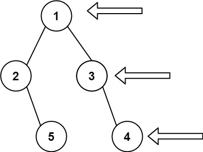

# [199. 二叉树的右视图](https://leetcode.cn/problems/binary-tree-right-side-view){target="_blank"}

## 题目

给定一个二叉树的 **根节点** `root`，想象自己站在它的右侧，按照从顶部到底部的顺序，返回从右侧所能看到的节点值。

示例 1:

{width="30%"}

> 输入：[1,2,3,null,5,null,4]

> 输出：[1,3,4]

示例 2:

> 输入：[1,null,3]

> 输出：[1,3]

## 复杂度

!!!note "深度优先搜索 DFS"

- [x] 时间复杂度：$O(n)$，其中 $n$ 为二叉树的节点个数。
- [x] 空间复杂度：$O(n)$。最坏情况下，二叉树退化成一条链，递归需要 $O(n)$ 的栈空间。

## 题解

```go title="Go"
func rightSideView(root *TreeNode) []int {
    ans := []int{}
    var dfs func(*TreeNode, int)
    dfs = func(node *TreeNode, dep int) {
        if node == nil {
            return
        }

        if dep == len(ans) {
            ans = append(ans, node.Val)
        }

        dfs(node.Right, dep+1)
        dfs(node.Left, dep+1)
    }

    dfs(root, 0)

    return ans
}
```

```python title="Python"
class Solution:
    def rightSideView(self, root: Optional[TreeNode]) -> List[int]:
        ans = []
        def dfs(node: Optional[TreeNode], depth: int) -> None:
            if node is None: return
            if depth == len(ans):
                ans.append(node.val)
            dfs(node.right, depth + 1)
            dfs(node.left, depth + 1)
        dfs(root, 0)
        return ans

```

## 参考
- [灵茶山艾府 199. 二叉树的右视图](https://leetcode.cn/problems/binary-tree-right-side-view/solutions/2015061/ru-he-ling-huo-yun-yong-di-gui-lai-kan-s-r1nc/)
