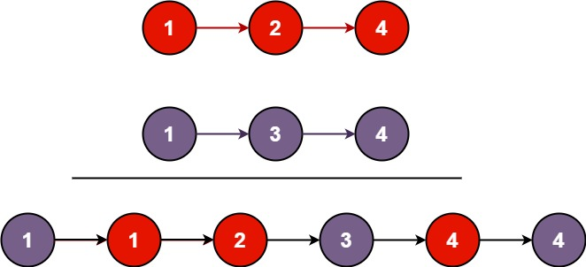

[https://leetcode.cn/problems/merge-two-sorted-lists](https://leetcode.cn/problems/merge-two-sorted-lists)

## 题目

将两个升序链表合并为一个新的 **升序** 链表并返回。新链表是通过拼接给定的两个链表的所有节点组成的。

示例 1:

{width="50%"}

> 输入：l1 = [1,2,4], l2 = [1,3,4]

> 输出：[1,1,2,3,4,4]

示例 2:

> 输入：l1 = [], l2 = []

> 输出：[]

## 复杂度

比较 $list_1$ 和 $list_2$ 的节点值，如果 $list_1$ 的节点值小，则把 $list_1$ 加到新链表的末尾，然后把 $list_1$ 替换成它的下一个节点。如果 $list_2$ 的节点值小则同理。如果两个节点值一样，那么把谁加到新链表的末尾都是一样的，不妨规定把 $list_2$ 加到新链表末尾。

- 时间复杂度：$O(n + m)$，其中 $n$ 为 $list_1$ 的长度，$m$ 为 $list_2$ 的长度。
- 空间复杂度：$O(1)$。

## 题解

```go title="Go"
func mergeTwoLists(l1 *ListNode, l2 *ListNode) *ListNode {
    prevHead := &ListNode{}

    prev := prevHead
    for l1 != nil && l2 != nil {
        if l1.Val <= l2.Val {
            prev.Next = l1
            l1 = l1.Next
        } else {
            prev.Next = l2
            l2 = l2.Next
        }
        prev = prev.Next
    }

    if l1 != nil {
        prev.Next = l1
    }

    if l2 != nil {
        prev.Next = l2
    }

    return prevHead.Next
}
```

```python title="Python"
class Solution:
    def mergeTwoLists(self, list1: Optional[ListNode], list2: Optional[ListNode]) -> Optional[ListNode]:
        cur = dummy = ListNode()  # 用哨兵节点简化代码逻辑
        while list1 and list2:
            if list1.val < list2.val:
                cur.next = list1  # 把 list1 加到新链表中
                list1 = list1.next
            else:  # 注：相等的情况加哪个节点都是可以的
                cur.next = list2  # 把 list2 加到新链表中
                list2 = list2.next
            cur = cur.next
        cur.next = list1 if list1 else list2  # 拼接剩余链表
        return dummy.next
```

[^1]: [灵茶山艾府-21. 合并两个有序链表](https://leetcode.cn/problems/merge-two-sorted-lists/solutions/2373691/liang-chong-fang-fa-die-dai-di-gui-pytho-wf75/?envType=study-plan-v2&envId=top-100-liked)
