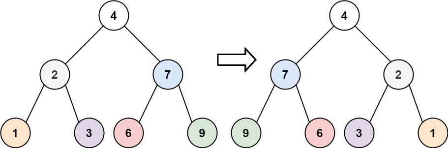
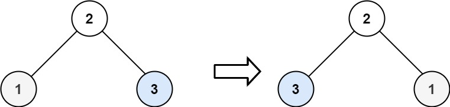

[https://leetcode.cn/problems/invert-binary-tree/description/](https://leetcode.cn/problems/invert-binary-tree/description/)

## 题目

给你一棵二叉树的根节点 root ，翻转这棵二叉树，并返回其根节点。

示例 1:

{ width="50%"}

> 输入：root = [4,2,7,1,3,6,9]

> 输出：[4,7,2,9,6,3,1]

示例 2:

{ width="50%"}

> 输入：root = [2,1,3]

> 输出：[2,3,1]

## 复杂度

采用**前序遍历**或者**后序遍历**

- 时间复杂度：$O(n)$
- 空间复杂度：$O(n)$

## 题解

```go title="Go"
func invertTree(root *TreeNode) *TreeNode {
    if root == nil {
        return nil
    }
    root.Left, root.Right = root.Right, root.Left    // 交换

    invertTree(root.Left)
    invertTree(root.Right)

    return root
}
```

```python title="Python"
class Solution:
    def invertTree(self, root: TreeNode) -> TreeNode:
        if not root:
            return None
        root.left, root.right = root.right, root.left
        self.invertTree(root.left)
        self.invertTree(root.right)
        return root
```
