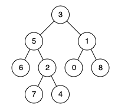

# [236. 二叉树的最近公共祖先](https://leetcode.cn/problems/lowest-common-ancestor-of-a-binary-tree){target="_blank"}

## 题目

给定一个二叉树, 找到该树中两个指定节点的最近公共祖先。

最近公共祖先的定义为：“对于有根树 T 的两个节点 p、q，最近公共祖先表示为一个节点 x，满足 x 是 p、q 的祖先且 x 的深度尽可能大（**一个节点也可以是它自己的祖先**）。”

示例 1:

{ width="30%"}

> 输入：root = [3,5,1,6,2,0,8,null,null,7,4], p = 5, q = 1

> 输出：3

示例 2:

{ width="30%"}

> 输入：root = [3,5,1,6,2,0,8,null,null,7,4], p = 5, q = 4

> 输出：5


## 题解

```go title="Go"
func lowestCommonAncestor(root, p, q *TreeNode) *TreeNode {
    if root == p || root == q || root == nil {
        return root
    }
    leftAncestor := lowestCommonAncestor(root.Left, p, q)
    rightAncestor := lowestCommonAncestor(root.Right, p, q)

    // 两边都不为空, 根节点为祖先
    if leftAncestor != nil && rightAncestor != nil {
        return root
    }
    if leftAncestor != nil {
        return leftAncestor
    }
    return rightAncestor
}
```

```python title="Python"
class Solution:
    def lowestCommonAncestor(self, root: 'TreeNode', p: 'TreeNode', q: 'TreeNode') -> 'TreeNode':
        if root == p or root == q or root == None:
            return root

        left = self.lowestCommonAncestor(root.left, p, q)
        right = self.lowestCommonAncestor(root.right, p, q)

        if left and right:
            return root
        return left or right
```


### 复杂度

递归遍历二叉树

- [x] 时间复杂度：$O(n)$
- [x] 空间复杂度：$O(n)$
