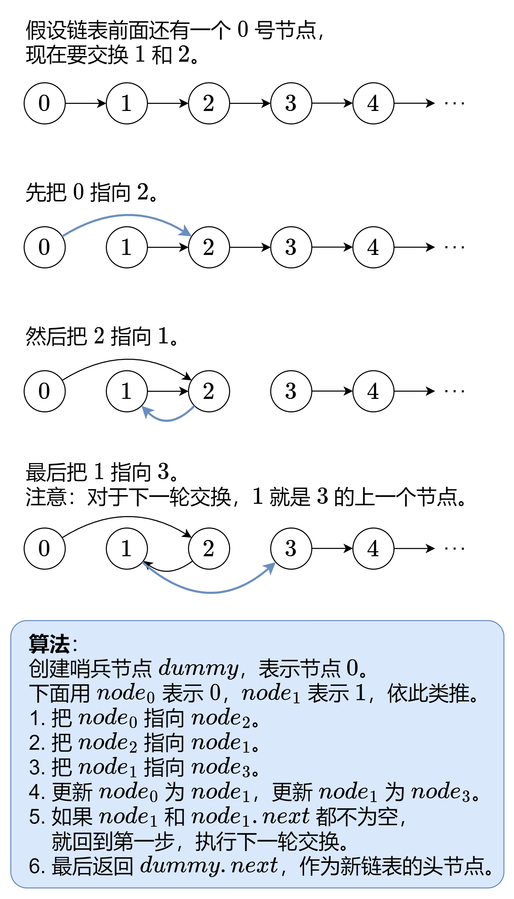

# [24. 两两交换链表中的节点](https://leetcode.cn/problems/swap-nodes-in-pairs){target="_blank"}

## 题目

给你一个链表，两两交换其中相邻的节点，并返回交换后链表的头节点。你必须在不修改节点内部的值的情况下完成本题（即，只能进行节点交换）。

示例 1:

> 输入：head = [1,2,3,4]

> 输出：[2,1,4,3]

示例 2:

> 输入：head = []

> 输出：[]

## 复杂度

虚拟头结点

- [x] 时间复杂度：$O(n)$
- [x] 空间复杂度：$O(1)$

## 题解

{width="600"}

```go title="Go"
func swapPairs(head *ListNode) *ListNode {
    dummy := &ListNode{Next: head} // 用哨兵节点简化代码逻辑
    node0 := dummy
    node1 := head
    for node1 != nil && node1.Next != nil { // 至少有两个节点
        node2 := node1.Next
        node3 := node2.Next

        node0.Next = node2 // 0 -> 2
        node2.Next = node1 // 2 -> 1
        node1.Next = node3 // 1 -> 3

        node0 = node1 // 下一轮交换，0 是 1
        node1 = node3 // 下一轮交换，1 是 3
    }
    return dummy.Next // 返回新链表的头节点
}
```

```python title="Python"
class Solution:
    def swapPairs(self, head: Optional[ListNode]) -> Optional[ListNode]:
        node0 = dummy = ListNode(next=head)  # 用哨兵节点简化代码逻辑
        node1 = head
        while node1 and node1.next:  # 至少有两个节点
            node2 = node1.next
            node3 = node2.next

            node0.next = node2  # 0 -> 2
            node2.next = node1  # 2 -> 1
            node1.next = node3  # 1 -> 3

            node0 = node1  # 下一轮交换，0 是 1
            node1 = node3  # 下一轮交换，1 是 3
        return dummy.next  # 返回新链表的头节点
```

- [灵茶山艾府-24.两两交换链表中的节点](https://leetcode.cn/problems/swap-nodes-in-pairs/solutions/2374872/tu-jie-die-dai-di-gui-yi-zhang-tu-miao-d-51ap/)
