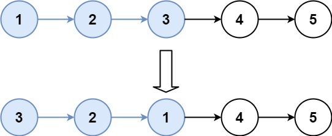

# [25. K 个一组翻转链表](https://leetcode.cn/problems/reverse-nodes-in-k-group){target="_blank"}

## 题目

给你链表的头节点 `head` ，每 `k` 个节点一组进行翻转，请你返回修改后的链表。

`k` 是一个正整数，它的值小于或等于链表的长度。如果节点总数不是 `k` 的整数倍，那么请将最后剩余的节点保持原有顺序。

你不能只是单纯的改变节点内部的值，而是需要实际进行节点交换。

示例 1:

{width="50%"}

> 输入：head = [1,2,3,4,5], k = 2

> 输出：[2,1,4,3,5]

示例 2:

{width="50%"}

> 输入：head = [1,2,3,4,5], k = 3

> 输出：[3,2,1,4,5]

## 复杂度

- [x] 时间复杂度：$O(n)$
- [x] 空间复杂度：$O(1)$

## 题解

```go title="Go"
func reverseKGroup(head *ListNode, k int) *ListNode {
    n := 0
    for cur := head; cur != nil; cur = cur.Next {
        n++ // 统计节点个数
    }

    dummy := &ListNode{Next: head}
    p0 := dummy
    var pre, cur *ListNode = nil, p0.Next
    for ; n >= k; n -= k {
        for i := 0; i < k; i++ {
            nxt := cur.Next
            cur.Next = pre // 每次循环只修改一个 Next，方便大家理解
            pre = cur
            cur = nxt
        }

        //
        nxt := p0.Next
        p0.Next.Next = cur
        p0.Next = pre
        p0 = nxt
    }
    return dummy.Next
}
```

```python title="Python"
class Solution:
    def reverseKGroup(self, head: Optional[ListNode], k: int) -> Optional[ListNode]:
        n = 0
        cur = head
        while cur:
            n += 1  # 统计节点个数
            cur = cur.next

        p0 = dummy = ListNode(next=head)
        pre = None
        cur = head
        while n >= k:
            n -= k
            for _ in range(k):  # 同 92 题
                nxt = cur.next
                cur.next = pre  # 每次循环只修改一个 next，方便大家理解
                pre = cur
                cur = nxt

            nxt = p0.next
            nxt.next = cur
            p0.next = pre
            p0 = nxt
        return dummy.next
```

## 参考
- [灵茶山艾府-25. K 个一组翻转链表](https://leetcode.cn/problems/reverse-nodes-in-k-group/solutions/1992228/you-xie-cuo-liao-yi-ge-shi-pin-jiang-tou-plfs/)
