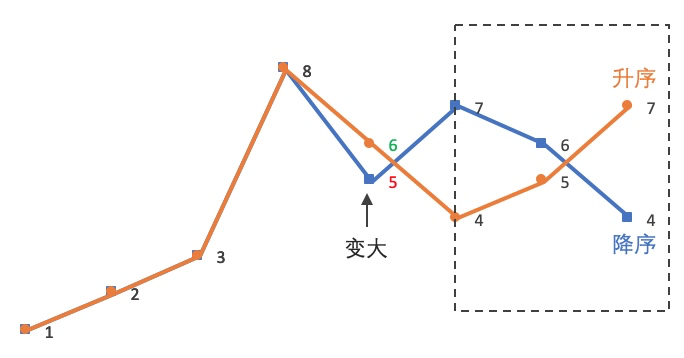

# [31. 下一个排列](https://leetcode.cn/problems/next-permutation){target="_blank"}

整数数组的一个 排列  就是将其所有成员以序列或线性顺序排列。

例如，`arr = [1,2,3]` ，以下这些都可以视作 `arr` 的排列：`[1,2,3]、[1,3,2]、[3,1,2]、[2,3,1]` 。
整数数组的 **下一个排列** 是指其整数的下一个字典序更大的排列。更正式地，如果数组的所有排列根据其字典顺序从小到大排列在一个容器中，那么数组的 **下一个排列** 就是在这个有序容器中排在它后面的那个排列。如果不存在下一个更大的排列，那么这个数组必须重排为字典序最小的排列（即，其元素按升序排列）。

- 例如，`arr = [1,2,3]` 的下一个排列是 `[1,3,2]` 。
- 类似地，`arr = [2,3,1]` 的下一个排列是 `[3,1,2]` 。
- 而 `arr = [3,2,1]` 的下一个排列是 `[1,2,3]` ，因为 `[3,2,1]` 不存在一个字典序更大的排列。

给你一个整数数组 `nums` ，找出 `nums` 的下一个排列。

必须 **原地** 修改，只允许使用额外常数空间。

## 思路

1. 先从后向前查找第一个相邻升序的元素对 `(i,j)`，这里 `i=4`，`j=5`，对应的值为 **5**，**7**：
2. 然后在 `[j,end)` 从后向前查找第一个大于 `A[i]` 的值 `A[k]`。
3. 将 `A[i]` 与 `A[k]` 交换。这里交换 **5**、**6**：
4. 这时 `[j,end)` 必然是降序，逆置 `[j,end)`，使其升序。这里逆置 `[7,5,4]`：
5. 因此，`12385764` 的下一个排列就是 `12386457`。

<center>
{ width=50% }
</center>


```go title="Go"
func nextPermutation(nums []int) {
	if len(nums) <= 1 {
		return
	}

	i, j, k := len(nums)-2, len(nums)-1, len(nums)-1

	// 从后向前 查找第一个 相邻升序 的元素对 (i,j), 满足 A[i] < A[j]
	for i >= 0 && nums[i] >= nums[j] {
		i--
		j--
	}

	if i >= 0 { // 不是最后一个排列
		// 在 [j,end) 从后向前 查找第一个满足: A[i]<A[k]
		for nums[i] >= nums[k] {
			k--
		}
		// 交换 A[i], A[k]
		nums[i], nums[k] = nums[k], nums[i]
	}

	// 此时 [j:end] 为降序，翻转使其升序
	for i, j := j, len(nums)-1; i < j; i, j = i+1, j-1 {
		nums[i], nums[j] = nums[j], nums[i]
	}
}
```

```py title="Python"
class Solution:
    def nextPermutation(self, nums: List[int]) -> None:
        if len(nums) <= 1:
            return
        
        i, j, k = len(nums)-2, len(nums)-1, len(nums)-1

        # 从后向前 查找第一个 相邻升序 的元素对 (i,j), 满足 A[i] < A[j]
        while i >= 0 and nums[i] >= nums[j]:
            i -= 1
            j -= 1

        if i >= 0: # 不是最后一个排列
            # 在 [j,end) 从后向前 查找第一个满足: A[i]<A[k]
            while nums[i] >= nums[k]:
                k -= 1
            # 交换 A[i], A[k]
            nums[i], nums[k] = nums[k], nums[i]

        # 此时 [j:end] 为降序，翻转使其升序
        i, j = j, len(nums) - 1
        while i < j:
            nums[i], nums[j] = nums[j], nums[i]
            i += 1
            j -= 1
```

### 复杂度

- [x] 时间复杂度：$O(n)$
- [x] 空间复杂度：$O(1)$

## 参考

- [下一个排列-力扣官方题解](https://leetcode.cn/problems/next-permutation/solutions/479151/xia-yi-ge-pai-lie-by-leetcode-solution/){target="_blank"}
- [下一个排列-Imageslr 详解：思路+推导+步骤](https://leetcode.cn/problems/next-permutation/solutions/80560/xia-yi-ge-pai-lie-suan-fa-xiang-jie-si-lu-tui-dao-/){target="_blank"}
