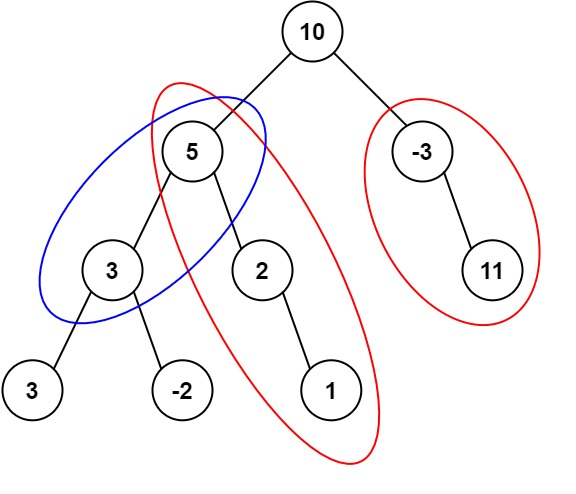

# [437. 路径总和 III](https://leetcode.cn/problems/path-sum-iii){target="_blank"}

## 题目

给定一个二叉树的根节点 `root` ，和一个整数 `targetSum` ，求该二叉树里节点值之和等于 `targetSum` 的 **路径** 的数目。

**路径** 不需要从根节点开始，也不需要在叶子节点结束，但是路径方向必须是向下的（只能从父节点到子节点）。

示例 1:

{width="30%"}

> 输入：root = [10,5,-3,3,2,null,11,3,-2,null,1], targetSum = 8

> 输出：3

示例 2:

> 输入：root = [5,4,8,11,null,13,4,7,2,null,null,5,1], targetSum = 22

> 输出：3

## 复杂度

前缀和

- [x] 时间复杂度：$O(n)$，其中 $n$ 为二叉树中节点的个数。
- [x] 空间复杂度：$O(n)$。

## 题解

```go title="Go"
func pathSum(root *TreeNode, targetSum int) int {
    preSum := map[int]int{0: 1}
    ans := 0
    var dfs func(*TreeNode, int)
    dfs = func(node *TreeNode, curr int) {
        if node == nil {
            return
        }

        curr += node.Val
        ans += preSum[curr - targetSum]
        preSum[curr]++

        dfs(node.Left, curr)
        dfs(node.Right, curr)
        preSum[curr]--
        return
    }
    dfs(root, 0)
    return ans
}
```

```python title="Python"
class Solution:
    def pathSum(self, root: TreeNode, targetSum: int) -> int:
        ret = 0
        dic = {0:1}

        def dfs(root: TreeNode, curr: int):
            nonlocal ret
            if not root:
                return

            curr += root.val
            ret += dic.get(curr - targetSum, 0)
            dic[curr] = dic.get(curr, 0) + 1
            dfs(root.left, curr)
            dfs(root.right, curr)
            dic[curr] -= 1

        dfs(root, 0)

        return ret
```
