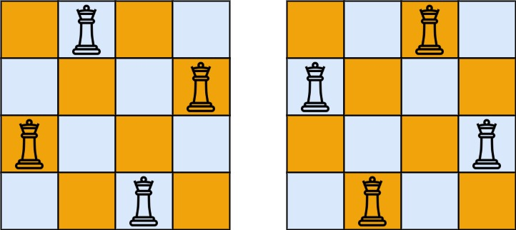

# [51. N 皇后](https://leetcode.cn/problems/n-queens){target="_blank"}

## 题目

按照国际象棋的规则，皇后可以攻击与之处在同一行或同一列或同一斜线上的棋子。

**n 皇后问题** 研究的是如何将 `n` 个皇后放置在 `n×n` 的棋盘上，并且使皇后彼此之间不能相互攻击。

给你一个整数 `n` ，返回所有不同的 **n 皇后问题** 的解决方案。

每一种解法包含一个不同的 **n 皇后问题** 的棋子放置方案，该方案中 `'Q'` 和 `'.'` 分别代表了皇后和空位。

示例 1:

{width="50%"}

> 输入：n = 4

> 输出：[[".Q..","...Q","Q...","..Q."],["..Q.","Q...","...Q",".Q.."]]

示例 2:

> 输入：n = 1

> 输出：[["Q"]]

## 复杂度

回溯

- [x] 时间复杂度：$O(n!)$。
- [x] 空间复杂度：$O(n)$。

## 题解

```go title="Go"
func solveNQueens(n int) [][]string {
    res := make([][]string, 0)
    // init
    chessboard := make([][]string, n)
    for i := 0; i < n; i++ {
        chessboard[i] = make([]string, n)
    }

    for i := 0; i < n; i++ {
        for j := 0; j < n; j++ {
            chessboard[i][j] = "."
        }
    }

    var backtrack func(row int)
    backtrack = func(row int) {
        if row == n {
            tmp := make([]string, n)
            for i, str := range chessboard {
                tmp[i] = strings.Join(str, "")
            }
            res = append(res, tmp)
            return
        }

        for col := 0; col < n; i++ {
            if IsValid(n, row, col, chessboard) {
                chessboard[row][col] = "Q" // 放置皇后
                backtrack(row+1)         //
                chessboard[row][col] = "." // 回溯、撤销皇后
            }
        }
    }
    backtrack(0)
    return res
}

func IsValid(n, row, col int, chessboard [][]string) bool {
    for i := 0; i < row; i++ {
        if chessboard[i][col] == "Q" {  // 检查列
            return false
        }
    }
    for i, j := row-1, col-1; i >= 0 && j >= 0; i, j = i-1, j-1 { // 45°
		if chessboard[i][j] == "Q" {
			return false
		}
	}
	for i, j := row-1, col+1; i >= 0 && j < n; i, j = i-1, j+1 {   // 135°
		if chessboard[i][j] == "Q" {
			return false
		}
	}
    return true
}
```

```python title="Python"
class Solution:
    def solveNQueens(self, n: int) -> List[List[str]]:
        result = []  # 存储最终结果的二维字符串数组

        chessboard = ['.' * n for _ in range(n)]  # 初始化棋盘
        self.backtracking(n, 0, chessboard, result)  # 回溯求解
        return [[''.join(row) for row in solution] for solution in result]  # 返回结果集

    def backtracking(self, n: int, row: int, chessboard: List[str], result: List[List[str]]) -> None:
        if row == n:
            result.append(chessboard[:])  # 棋盘填满，将当前解加入结果集
            return

        for col in range(n):
            if self.isValid(row, col, chessboard):
                chessboard[row] = chessboard[row][:col] + 'Q' + chessboard[row][col+1:]  # 放置皇后
                self.backtracking(n, row + 1, chessboard, result)  # 递归到下一行
                chessboard[row] = chessboard[row][:col] + '.' + chessboard[row][col+1:]  # 回溯，撤销当前位置的皇后

    def isValid(self, row: int, col: int, chessboard: List[str]) -> bool:
        # 检查列
        for i in range(row):
            if chessboard[i][col] == 'Q':
                return False  # 当前列已经存在皇后，不合法

        # 检查 45 度角是否有皇后
        i, j = row - 1, col - 1
        while i >= 0 and j >= 0:
            if chessboard[i][j] == 'Q':
                return False  # 左上方向已经存在皇后，不合法
            i -= 1
            j -= 1

        # 检查 135 度角是否有皇后
        i, j = row - 1, col + 1
        while i >= 0 and j < len(chessboard):
            if chessboard[i][j] == 'Q':
                return False  # 右上方向已经存在皇后，不合法
            i -= 1
            j += 1

        return True  # 当前位置合法
```
