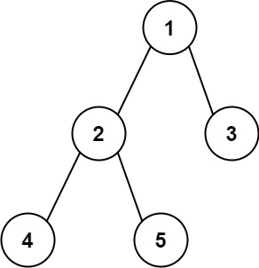

[https://leetcode.cn/problems/diameter-of-binary-tree](https://leetcode.cn/problems/diameter-of-binary-tree)

## 题目

给你一棵二叉树的根节点，返回该树的 **直径** 。

二叉树的 **直径** 是指树中任意两个节点之间最长路径的 **长度** 。这条路径可能经过也可能不经过根节点 `root` 。

两节点之间路径的 **长度** 由它们之间边数表示。

示例 1:

{width="30%"}

> 输入：root = [1,2,3,4,5]

> 输出：3

示例 2:

> 输入：root = [1,2]

> 输出：1

## 复杂度

- 时间复杂度：$O(n)$，其中 $n$ 为二叉树的节点个数。
- 空间复杂度：$O(n)$。最坏情况下，二叉树退化成一条链，递归需要 $O(n)$ 的栈空间。

## 题解

```go title="Go"
func diameterOfBinaryTree(root *TreeNode) int {
    maxDia := 0
    var dfs func(node *TreeNode) int
    dfs = func(node *TreeNode) int {
        if node == nil {
            return -1
        }

        left := dfs(node.Left) + 1
        right := dfs(node.Right) + 1
        maxDia = max(maxDia, left+right)
        return max(left, right)
    }
    dfs(root)
    return maxDia
}

func max(a, b int) int {
    if a > b {
        return a
    }
    return b
}
```

```python title="Python"
class Solution:
    def diameterOfBinaryTree(self, root: Optional[TreeNode]) -> int:
        ans = 0
        def dfs(node):
            if node is None:
                return -1
            l_len = dfs(node.left) + 1
            r_len = dfs(node.right) + 1
            nonlocal ans
            ans = max(ans, l_len + r_len)
            return max(l_len, r_len)
        dfs(root)
        return ans

```
