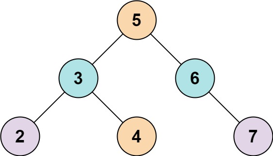
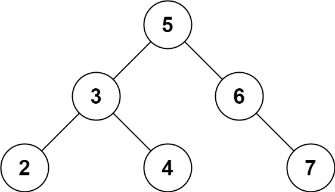

# [653. 两数之和 IV - 输入二叉搜索树](https://leetcode.cn/problems/two-sum-iv-input-is-a-bst/description/){target="_blank"}

## 题目

给定一个二叉搜索树 `root` 和一个目标结果 `k`，如果二叉搜索树中存在两个元素且它们的和等于给定的目标结果，则返回 `true`。


**示例 1:**

{ width="30%"}

> 输入: root = [5,3,6,2,4,null,7], k = 9

> 输出: true


**示例 2:**

{ width="30%"}

> 输入: root = [5,3,6,2,4,null,7], k = 28

> 输出: false


## 题解

!!!note "中序遍历+双指针"

    中序遍历得到升序数组。之后使用双指针确定是否存在 `nums[i] + nums[j] = k`。

```go title="Go"
func findTarget(root *TreeNode, k int) bool {
    arr := []int{}
    var inorderTraversal func(*TreeNode)
    inorderTraversal = func(node *TreeNode) {
        if node != nil {
            inorderTraversal(node.Left)
            arr = append(arr, node.Val)
            inorderTraversal(node.Right)
        }
    }
    inorderTraversal(root)

    left, right := 0, len(arr)-1
    for left < right {
        sum := arr[left] + arr[right]
        if sum == k {
            return true
        }
        if sum < k {
            left++
        } else {
            right--
        }
    }
    return false
}
```

```python title="Python"
# Definition for a binary tree node.
# class TreeNode:
#     def __init__(self, val=0, left=None, right=None):
#         self.val = val
#         self.left = left
#         self.right = right
class Solution:
    def findTarget(self, root: Optional[TreeNode], k: int) -> bool:
        arr = []

        def inorder_traversal(node: Optional[TreeNode]) -> None:
            """中序遍历"""
            if node:
                inorder_traversal(node.left)
                arr.append(node.val)
                inorder_traversal(node.right)
        
        inorder_traversal(root)

        left, right = 0, len(arr) - 1
        while left < right:
            _sum = arr[left] + arr[right]
            if _sum == k:
                return True
            
            if _sum < k:
                left += 1
            else:
                right -= 1
        
        return False
```

### 复杂度

- [x] 时间复杂度: $O(n)$，其中 $n$ 为二叉搜索树的大小。需要遍历整棵树一次，并对得到的升序数组使用双指针遍历。
- [x] 空间复杂度: $O(n)$。其中 $n$ 为二叉搜索树的大小。主要为升序数组的开销。

## 参考
- [LeetCode官方题解 653. 两数之和 IV - 输入 BST](https://leetcode.cn/problems/two-sum-iv-input-is-a-bst/solutions/1347526/liang-shu-zhi-he-iv-shu-ru-bst-by-leetco-b4nl/){target="_blank"}
