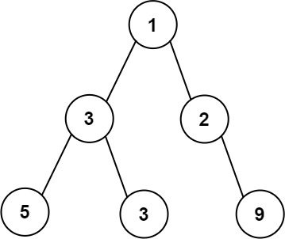
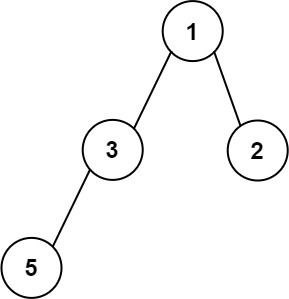

# [662. 二叉树最大宽度](https://leetcode.cn/problems/maximum-width-of-binary-tree/description/){target="_blank"}

## 题目

给你一棵二叉树的根节点 `root` ，返回树的**最大宽度**。

树的**最大宽度**是所有层中最大的**宽度**。

每一层的**宽度**被定义为该层最左和最右的非空节点（即，两个端点）之间的长度。将这个二叉树视作与满二叉树结构相同，两端点间会出现一些延伸到这一层的 `null` 节点，这些 `null` 节点也计入长度。

题目数据保证答案将会在**32 位**带符号整数范围内。

示例 1:

{ width="30%"}

> 输入：root = [1,3,2,5,3,null,9]

> 输出：7

> 解释：最大宽度出现在树的第 4 层，宽度为 7 (6,null,null,null,null,null,7) 。

示例 2:

{ width="30%"}

> 输入：root = [1,3,2,5,null,null,9,6,null,7]

> 输出：5

示例 3:

{ width="30%"}

> 输入：root = [1,3,2,5]

> 输出：2

> 解释：最大宽度出现在树的第 2 层，宽度为 2 (3,2) 。


## 题解

```go title="Go"
/**
 * Definition for a binary tree node.
 * type TreeNode struct {
 *     Val int
 *     Left *TreeNode
 *     Right *TreeNode
 * }
 */
func widthOfBinaryTree(root *TreeNode) (ans int) {
    queue := []Pair{Pair{1, root}}
    for size := len(queue); size > 0; size = len(queue) {
        min, max := 0, 0
        for i := 0; i < size; i++ {
            pair := queue[i]
            code, node := pair.Code, pair.Node
            if i == 0 {
                min = code
            }
            if i == size - 1 {
                max = code
            }
            if node.Left != nil {
                queue = append(queue, Pair{code << 1, node.Left})
            }
            if node.Right != nil {
                queue = append(queue, Pair{(code << 1) + 1, node.Right})
            }
        }
        queue = queue[size:]
        if d := max - min + 1; d > ans {
            ans = d
        }
    }
    return
}

type Pair struct {
    Code int
    Node *TreeNode
}
```

```python title="Python"
# Definition for a binary tree node.
# class TreeNode:
#     def __init__(self, val=0, left=None, right=None):
#         self.val = val
#         self.left = left
#         self.right = right
class Solution:
    def widthOfBinaryTree(self, root: Optional[TreeNode]) -> int:
        ans, queue = 0, deque([(1, root)])
        while queue:
            mn, mx = inf, 0
            for _ in range(len(queue)):
                code, node = queue.popleft()
                if node.left:
                    queue.append((code * 2, node.left))
                if node.right:
                    queue.append((code * 2 + 1, node.right))
                mn, mx = min(code, mn), max(code, mx)
            ans = max(ans, mx - mn + 1)
        return ans
```


### 思路

1. 使用队列进行 **BFS 遍历**，每个节点存储其 索引（假设根节点索引为 0）。
2. 遍历每一层时：
    - 记录该层的**最左节点索引**和**最右节点索引**。
    - 宽度计算公式：`当前层宽度 = 最右索引 - 最左索引 + 1`。
    - 遍历子节点时，左子节点索引 `2 * index`，右子节点索引 `2 * index + 1`。
3. 取所有层中的最大宽度。

### 复杂度
- [x] 时间复杂度：$O(n)$
- [x] 空间复杂度：$O(n)$


## 参考

- [Benhao - 662. 二叉树最大宽度](https://leetcode.cn/problems/maximum-width-of-binary-tree/solutions/1778717/pythonjavatypescriptgo-by-himymben-6rd9/)