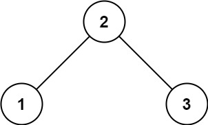
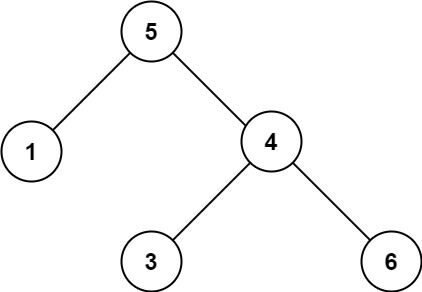

# [98. 验证二叉搜索树](https://leetcode.cn/problems/validate-binary-search-tree){target="_blank"}

## 题目

给你一个二叉树的根节点 `root` ，判断其是否是一个有效的二叉搜索树。

**有效** 二叉搜索树定义如下：

- 节点的左子树 只包含 小于 当前节点的数。
- 节点的右子树只包含 大于 当前节点的数。
- 所有左子树和右子树自身必须也是二叉搜索树。

示例 1:

{width="30%"}

> 输入：root = [2,1,3]

> 输出：true

示例 2:

{width="30%"}

> 输入：root = [5,1,4,null,null,3,6]

> 输出：false

## 复杂度

前序遍历

- [x] 时间复杂度：$O(n)$，其中 $n$ 为二叉树的节点个数。
- [x] 空间复杂度：$O(n)$。最坏情况下，二叉树退化成一条链，递归需要 $O(n)$ 的栈空间。

## 题解

```go title="Go"
func isValidBST(root *TreeNode) bool {
    return checkBST(root, math.MinInt64, math.MaxInt64)
}

func checkBST(node *TreeNode, min, max int) bool {
    if node == nil {
        return true
    }

    x := node.Val
    return min < x && x < max &&
        checkBST(node.Left, min, x) &&
        checkBST(node.Right, x, max)
}
```

```python title="Python"
class Solution:
    def isValidBST(self, root: Optional[TreeNode]) -> bool:
        def checkBST(node: Optional[TreeNode], left=-inf, right=inf) -> bool:
            if node is None:
                return True
            x = node.val
            return left < x < right and \
                checkBST(node.left, left, x) and \
                checkBST(node.right, x, right)

        return checkBST(root)
```

- [灵茶山艾府 98. 验证二叉搜索树](https://leetcode.cn/problems/validate-binary-search-tree/solutions/2020306/qian-xu-zhong-xu-hou-xu-san-chong-fang-f-yxvh/)
