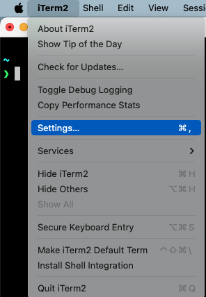
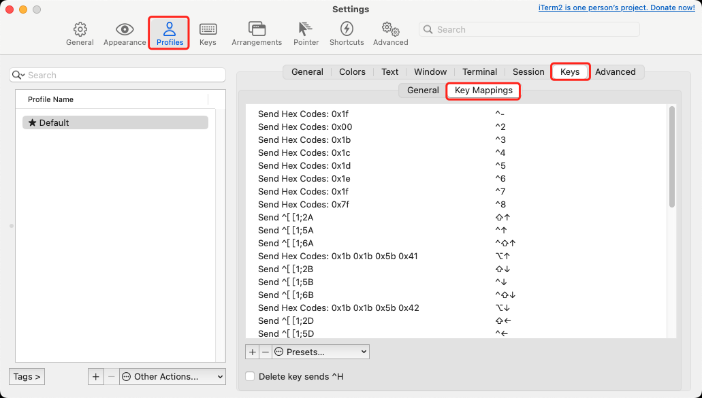
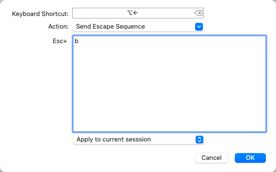
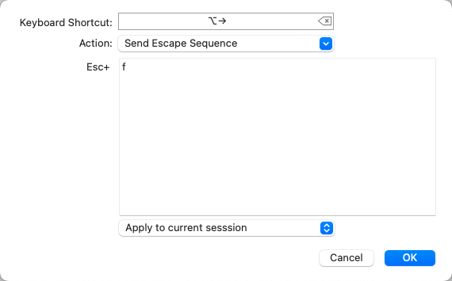
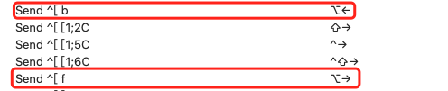

---
categories:
  - Mac
---

## iTerm2 光标快速跳词移动

打开 iTerm2 的 `Settings` 或者 `Perferences`。

<figure markdown="span">
  
  <figcaption>iTerm2 Settings</figcaption>
</figure>

选择当前Profiles --> 选择 `Keys` 选项 --> 选择 `Key Mappings` 。

<figure markdown="span">
  
  <figcaption>iTerm2 Settings Key Mappings</figcaption>
</figure>

修改 `option <-` 和 `option ->`。 Action 选择为 **Send Escape Sequence**。

- `option <-` 对应 **b**
- `option ->` 对应 **f**

<figure markdown="span">
  { loading=lazy }
  <figcaption>option left</figcaption>
</figure>

<figure markdown="span">
  { loading=lazy }
  <figcaption>option right</figcaption>
</figure>

<figure markdown="span">
  { loading=lazy }
  <figcaption>Result</figcaption>
</figure>
