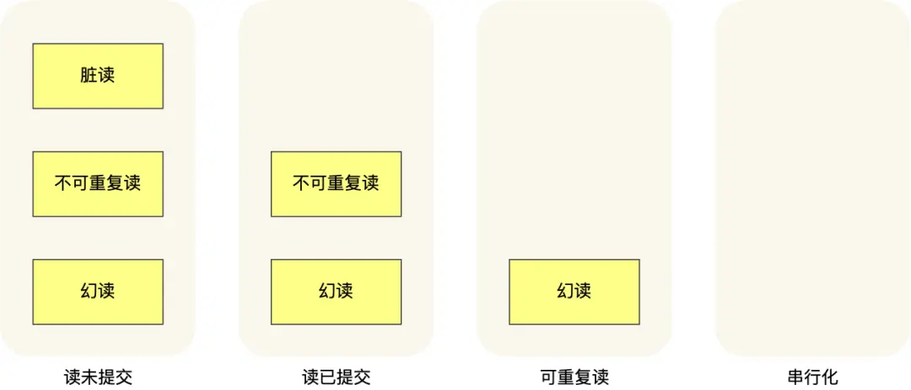

事务的定义很严格，它必须同时满足四个特性，即原子性、一致性、隔离性和持久性，也就是人们俗称的 ACID 特性，具体如下

## 并行事务引发的问题

**严重性排序: 脏读 > 不可重复读 > 幻读**

| 问题       | 说明                                                                                                                           | 概要                           |
| ---------- | ------------------------------------------------------------------------------------------------------------------------------ | ------------------------------ |
| 脏读       | 如果一个事务「读到」了另一个「未提交事务修改过的数据」，就意味着发生了「脏读」现象。                                           | ==读到其他事务未提交的数据；== |
| 不可重复读 | 在一个事务内多次读取同一个数据，如果出现前后两次读到的数据不一样的情况，就意味着发生了「不可重复读」现象。                     | ==前后读取的数据不一致；==     |
| 幻读       | 在一个事务内多次查询某个符合查询条件的「记录数量」，如果出现前后两次查询到的记录数量不一样的情况，就意味着发生了「幻读」现象。 | ==前后读取的记录数量不一致。== |

## 事务隔离级别

- **读未提交（_read uncommitted_）**，指一个事务还没提交时，它做的变更就能被其他事务看到；
- **读提交（_read committed_）**，指一个事务提交之后，它做的变更才能被其他事务看到；
- **可重复读（_repeatable read_）**，指一个事务执行过程中看到的数据，一直跟这个事务启动时看到的数据是一致的，==**MySQL InnoDB 引擎的默认隔离级别**==；
- **串行化（*serializable* ）**；会对记录加上读写锁，在多个事务对这条记录进行读写操作时，如果发生了读写冲突的时候，后访问的事务必须等前一个事务执行完成，才能继续执行

按隔离水平高低排序如下


针对不同的隔离级别，并发事务时可能发生的现象也会不同。



- 在「读未提交」隔离级别下，可能发生脏读、不可重复读和幻读现象；
- 在「读提交」隔离级别下，可能发生不可重复读和幻读现象，但是不可能发生脏读现象；
- 在「可重复读」隔离级别下，可能发生幻读现象，但是不可能脏读和不可重复读现象；
- 在「串行化」隔离级别下，脏读、不可重复读和幻读现象都不可能会发生。

mysql 可以通过下面的语句来查询数据库的默认隔离级别

```sql
select @@global.transaction_isolation,@@transaction_isolation;

```

## 可重复读时如何避免幻读的？

MySQL InnoDB 引擎的默认隔离级别虽然是「可重复读」，但是它很大程度上避免幻读现象（并不是完全解决了），解决的方案有两种：

- 针对**快照读**（普通 select 语句），是 ==**通过 MVCC 方式解决了幻读**== ，因为可重复读隔离级别下，事务执行过程中看到的数据，一直跟这个事务启动时看到的数据是一致的，即使中途有其他事务插入了一条数据，是查询不出来这条数据的，所以就很好了避免幻读问题。
- 针对**当前读**（`select ... for update` 等语句），是 ==**通过 next-key lock（记录锁+间隙锁）方式解决了幻读**== ，因为当执行 `select ... for update` 语句的时候，会加上 next-key lock，如果有其他事务在 next-key lock 锁范围内插入了一条记录，那么这个插入语句就会被阻塞，无法成功插入，所以就很好了避免幻读问题。

**可重复读隔离级别下虽然很大程度上避免了幻读，但是还是没有能完全解决幻读**。

!!!note "两个发生幻读场景的例子"

    第一个例子：对于快照读， MVCC 并不能完全避免幻读现象。因为当事务 A 更新了一条事务 B 插入的记录，那么事务 A 前后两次查询的记录条目就不一样了，所以就发生幻读。

    第二个例子：对于当前读，如果事务开启后，并没有执行当前读，而是先快照读，然后这期间如果其他事务插入了一条记录，那么事务后续使用当前读进行查询的时候，就会发现两次查询的记录条目就不一样了，所以就发生幻读。

    要避免这类特殊场景下发生幻读的现象的话，就是尽量在开启事务之后，马上执行 `select ... for update` 这类当前读的语句，因为它会对记录加 `next-key lock`，从而避免其他事务插入一条新记录。

## MVCC

**MVCC 多版本并发控制（Multi-Version Concurrency Control）**，是在读取数据时通过**一种类似快照的方式将数据保存下来**，这样读锁和写锁不冲突了，不同的事物 session 会看到自己特定版本的数据，我们称之为版本链。

### MVCC 工作的隔离级别

- **Read Uncommitted 读未提交**：为了读取到其他事物未提交的数据，总是会读取最新的数据行，而不是符合当前事物版本的数据行
- **Serializable 串行化**：已经对所有并发操作的数据行都进行加锁了，已经没有并发问题了，当然也不需要 MVCC 了

对于**「READ COMMITTED 读提交」和「Repeatable Read 可重复读」**隔离级别的事务来说，**它们是通过 Read View 来实现的，它们的区别在于创建 Read View 的时机不同**：

- **「读提交」隔离级别是在每个 select 都会生成一个新的 Read View**，也意味着，事务期间的多次读取同一条数据，前后两次读的数据可能会出现不一致，因为可能这期间另外一个事务修改了该记录，并提交了事务。
- **「可重复读」隔离级别是启动事务时生成一个 Read View，然后整个事务期间都在用这个 Read View**，这样就保证了在事务期间读到的数据都是事务启动前的记录。

这两个隔离级别实现是通过**「事务的 Read View 里的字段」和「记录中的两个隐藏列」的比对**，来控制并发事务访问同一个记录时的行为，这就叫 MVCC（多版本并发控制）。

### MVCC 实现原理

MVCC 的目的就是多版本并发控制，在数据库中的实现，就是为了解决读写冲突，它的实现原理主要是依赖记录中的 ==3 个隐式字段，undo 日志 ，Read View== 来实现的。

隐藏字段中其实只有两个是必要的，分别是 trx_id 和 roll_pointer

- trx_id：用来存储每次对某条聚簇索引记录进行修改的时候的事物 Id
- roll_pointer：每次对那条索引记录上有修改的时候，都会把老版本写入 undo 日志中。这个 roll_pointer 就是存了一个指针，它指向这条索引记录的上一个版本的位置，通过它来获得上一个版本的记录信息（注意插入操作的 undo 日志没有这个属性，因为它没有老版本）

- [小林 coding-图解 MySQL 事务篇](https://xiaolincoding.com/mysql/transaction/mvcc.html)
