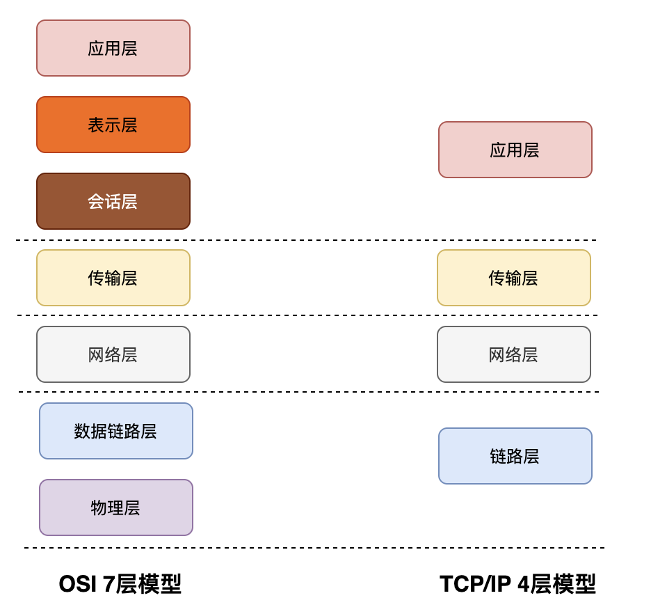

## TCP/IP 网络模型有哪几层？

TCP/IP 模型是互联网的基础，它是一系列网络协议的总称。这些协议可以划分为**四层，分别为链路层、网络层、传输层和应用层**。

- **链路层（Link layer）**：负责封装和解封装 IP 报文，发送和接受 ARP/RARP 报文等。
- **网络层（Internet layer）**：负责路由以及把分组报文发送给目标网络或主机。
- **传输层（Transport layer）**：负责对报文进行分组和重组，并以 TCP 或 UDP 协议格式封装报文。
- **应用层（Application layer）**：负责向用户提供应用程序，比如 HTTP、FTP、Telnet、DNS、SMTP 等。

## OSI 七层模型

OSI 七层模型：**物理层、数据链路层、网络层、传输层、会话层、表示层和应用层**。

- **物理层（Physical Layer）**：比特率传输。
- **数据链路层（Data Link Layer）**：控制网络层与物理层之间通信。
- **网络层（Network Layer）**：IP 寻址和路由选择。
- **传输层（Transport Layer）**：建立、维护、管理端到端连接。
- **会话层（Session Layer）**：建立、维护、管理会话连接。
- **表现层（Presentation Layer）**：数据格式化，加密、解密。
- **应用层（Application Layer）**：为应用程序提供网络服务。

---
- [深入理解 TCP/IP 模型](https://zhuanlan.zhihu.com/p/33797520)
